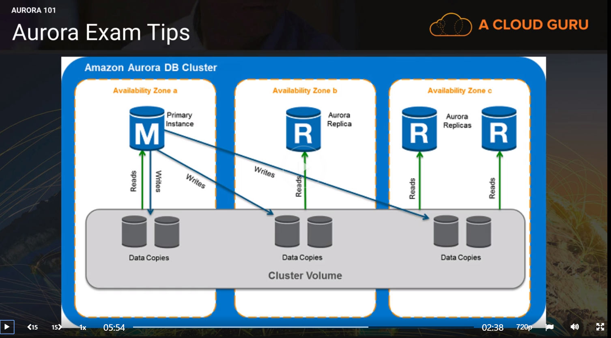

# High Availability

## Elasticity & Scalability 101

### Elasticity

- __Elasticity__ is used to scale up & down your infra, based on demand.
- Under this model you pay for what you need.
- Is used for short time periods, hours or days.
- Scale with demand (short term)

### Scalability

- __Scalability__ is used to talk about building your infra according to __long term__ demands.
- Long time periods: days, weeks, months, years.
- Scale out infrastructure (long term)

#### EC2

- Scalability - Increase __instance size__ as required using reserved instances.
- Elasticity - Increase __number of instances__, based on autoscaling.

#### DynamoDB - Scal-Elast

- Scalability - Unlimited amount of storage
- Elasticity - Increase additional IOPS for spikes in traffic. Decrease IOPS after traffic period.

#### RDS

- Scalability - Increase __instance size__, e.g. small to medium. (Downtime, done on maintenance windows)
- Elasticity -Not very elastic, cannot scale RDS based on demand. (You can scale on demand with Aurora)

#### Aurora

- Scalability - Modify __instance type__
- Elasticity - Aurora serverless, scale on demand.

## RDS - Multi AZ Failover

Two flavours:

1. Multi AZ - keeps copy of production database in separate AZ, in case of failure. AWS manages failure from one AZ to another, automatically.
2. Read Replicas

### Failover procedure

- AWS updates RDS endpoint DNS & points it to healthy AZ copy, in case of primary AZ failure.
- Multi-AZ is for __disaster recovery only.__ NOT a __scaling solution.__ It is not used to improve performance <- use __Read Replicas__ for that.
- AWS handles replication, when a production db is written to, the __write__ will automatically be synced to the stand by __database__.
- In the event of __planned db maintenance, db instance failure or AZ failure__ RDS will automatically failover to the standby to resume quickly db operations.
- Downtime is __unavoidable__, but short (about a minute for the failover to complete).
- `RDS` Instance -> `Actions` -> `Reboot` -> Selected `Reboot with Failover`

> Failover is handled by AWS, and the failover mechanism automatically changes the DNS record of the DB instance to point to the standby DB instance.

### Multi AZ Deployments

- MySQL, Oracle, Postgresql engines use synchronous physical replication to keep data on the standby in sync with the primary.
- SQL Server (MSSQL) engine uses synchronous logical replication - SQL Server native Mirroring technology.

### Multi AZ advantages & characteristics

- High Availability
- Backups - Restores are taken from the secondary which avoids I/O suspension to the primary.
- You can force an AZ failover by __rebooting__ RDS Instance. Done from AWS Management Console or from API call `RebootDBInstance`

## RDS - Read Replicas

- Read replicas make it easy to use database engine's built-in replication functionality to elastically scale out, beyond the capacity constraints of a single DB Instance, for __read-heavy__ workloads.
- __Read Only__ copies of your DB
- AWS Management Console or `CreateDBInstanceReadReplica` API call.
- Once the Read Replica has been created, db updates on the source will be replicated using the __db engine's native, asynchronous replication.__
- You can create multiple Read Replicas for a given source DB Instance, and distribute read traffic between them.
- Up to 5 Read Replicas for MySQL, MariaDB, PostgreSQL.
- You can have Read Replicas in __different regions__ for all engines.
- Asynchronous only.
- Read Replicas themselves can be __Multi-AZ.__
- You can have Read Replicas of Read Replicas. Beware of __latency__
- DB Snapshots & automated backups cannot be taken of RR.
- Key Metric: __REPLICA LAG__

### When to use Read Replicas

- Scaling beyond compute or I/O capacity of single DB Instance for __read-heavy__ db workloads. The excess read traffic will be directed to one or more Read Replicas.
- Serving DB read traffic, while source DB Instance is __unavailable.__ If source DB cannot take requests, due to __maintenance__ or __I/O suspension during backups__, you can direct traffic to the Read Replicas.
- __Business reporting__ or __data warehousing__ scenarios. Queries run against a read replica, rather than the primary production DB Instance. (Also import data into __AWS Redshift__ for this)

### Backups

- When Backups are `ON` & `Backup Retention Period` is set to 0 days -> Backups are `OFF`

### Read Replicas Supported Versions

- MySQL
- PostgreSQL
- MariaDB
> AWS uses native async replication to update the read replica

- Aurora
> Aurora utilizes am SSD backed virtualized storage layer, purposely built for database workloads. Aurora replicas share the same underlying storage as the source instances, lowering costs & avoiding the need to copy data on the replica nodes.

### Create Read Replica

- In order to be able to create RR, you have to have __backups__ ON. This also stands true if you want to create __Read Replica of a Read Replica__ (careful of __replication lag__ in this case)
- On create AWS takes a snapshot of the DB.
- If __multi-AZ is not enabled__, snapshot will be of primary DB and will cause __brief I/O suspension__ for around __1 min__.
- If __multi-AZ is enabled__, snapshot will be from secondary DB and not experience performance hits on primary.
- When a Read Replica is created, you will be able to connect using a __new DNS endpoint.__
- Read Replicas can be on __another region__ to the primary.
- Also Read Replicas can be __Multi-AZ__
- Read Replicas __can be promoted.__ You can promote a read replica to it's own standalone db instance. Doing so will __break__ the replication link between primary and secondary.

> Multi - AZ & Read Replica are available for modification after initial RDS Creation. __Warning! Downtime expected__.

### Find Version of RDS

```Shell
aws rds describe-db-instances --region eu-west-1 --profile training
```

## ElastiCache

- Significantly improve latency & throughput for read-heavy app workloads (e.g. social network, gaming, media) or compute-intesive workloads (e.g. recommendation engine).
- Store in-memory, critical pieces of information such as I/O intensive database queries or results of compute-intensive calculations.

### Types of ElastiCache

- Memcached: __Memory object mapping__ caching system. Does not support Multi-AZ.
- Redis: Open Source __In-Memory key-value store__ that supports data structures such as __sorted sets__ & __lists__. Supports Master / Slave Replication & Multi-AZ to achieve cross AZ redundancy.

### ElastiCache Metrics to monitor

- CPU utilization
- Swap Usage
- Evictions
- Concurrent connections

### Use Cases

DB is under stress/load.

- ElastiCache if __read-heavy__ and not prone to __frequent changes__.
- Redshift if management is running OLAP transactions etc.

## Aurora 101

- Relational db engine.
- MySQL/PostgreSQL compatible.
- Combines speed & ha of commercial dbs with simplicity & cost-effectiveness of open source dbs.
- Up to 5 times better performance to MySQL. Up to 3 times better performance to PostgreSQL.
- Price: 1/10th of commercial dbs (MSSQL, Oracle)
- Stores 6 copies of data across 3 AZs. Think of Aurora as a cluster.
- Aurora global database feature is now available (NEW).
- __Backtrack__ rollback db up to 72 hours without restore from backup. Costs extra.



### Aurora Scaling

- __Storage Autoscaling.__ Start with 10GB and scale up in 10GB increments, up to 64TB.
- __Compute Scaling.__ Up to 64vCPUs & 488GiB Memory.
- 2 Copies of Data are stored in each AZ, with a minimum of 3 AZs.
- Designed to transparently handle the loss of up to __2 copies__ without affecting __write__ availability & __3 copies__ without affecting __read__ availability.
- Aurora Storage is __self-healing.__ Data blocks & disks are continuously scanned for errors & fixed automatically.
- __Cluster Volume__ is spread across 3 AZs. It contains all data copies.
- Up to 15 Read Replicas total.

### Types of Aurora Replicas

- __Aurora Replicas (15)__
- __MySQL Read Replicas (15)__

#### Aurora at 100% CPU Utilization

- If __Writes__ cause the issue: __Scale Up__ - Increase instance size
- If __Reads__ cause the issue: __Scale Out__ - Increase number of read replicas

### Aurora Serverless

- On-demand, auto-scaling Aurora (Only MySQL compatible) where db will automatically start-up, shutdown, scale up/down capacity based on application needs.
- Pay per second basis of usage when db is active. You can migrate between standard & serverless configurations in AWS RDS Management Console.

### Aurora Database Design Types

- One writer and multiple readers
- One writer and multiple readers - Parallel query
- Multiple writers
- Serverless

#### One writer and multiple readers

Supports multiple reader instances connected to the same storage volume as a single writer instance. This is a good general-purpose option for most workloads.

#### One writer and multiple readers - Parallel query

Improves the performance of analytic queries by pushing processing down to the Aurora storage layer. This is a good option for hybrid transactional/analytic workloads.

#### Multiple writers

Supports multiple writer instances connected to the same storage volume. This is a good option for when continuous writer availablility is required.

#### Serverless

You specify the minimum and maximum amount of resources needed, and Aurora scales the capacity based on database load. This is a good option for intermittent or unpredictable workloads.

### Aurora Reader vs Aurora Cross Region Read Replica

The Aurora __"reader"__ is synonymous with the __RDS "read replica"__. In Aurora, you can create up to __15 read replicas__ (as opposed to only __5__). The client applications should connect to the single __"reader endpoint"__ which will perform the __load balancing__ between the available read replicas. The Aurora read replicas all read the data from the same underlying storage volume as the primary instance that is in the same region. The __"Cross region read replica"__ allows you to setup an additional read replica cluster in a different region.

### Aurora Tips

- __Encryption at rest__ is turned __on__ by default. All read replicas will be encrypted if on.
- __Failover__ is defined by tiers. Highest priority available: `Tier-0`.
- Creating a __cross-region Aurora replica__ will create an entirely new Aurora __cluster__ in the target region. If replication is __disrupted__, you will have to set-up again. Recommended __Multi-AZ Deployment__ to ensure HA for the target cluster.

### RDS Performance Insights - RDS Enhanced Monitoring granularity

- If your DB instance __runs out of storage space__, it might no longer be __available__.
- Constantly monitor the `FreeStorageSpace` metric published in `CloudWatch`
- [https://docs.aws.amazon.com/AmazonRDS/latest/UserGuide/USER_PerfInsights.html](https://docs.aws.amazon.com/AmazonRDS/latest/UserGuide/USER_PerfInsights.html)
- `RDS` Enhanced monitoring granularity can go down to 1 sec

### RDS out of Storage Capacity

- [https://docs.aws.amazon.com/AmazonRDS/latest/UserGuide/CHAP_Troubleshooting.html#CHAP_Troubleshooting.Storage](https://docs.aws.amazon.com/AmazonRDS/latest/UserGuide/CHAP_Troubleshooting.html#CHAP_Troubleshooting.Storage)
- [https://aws.amazon.com/premiumsupport/knowledge-center/rds-out-of-storage/](https://aws.amazon.com/premiumsupport/knowledge-center/rds-out-of-storage/)

## Trouble Shoot Auto-Scaling Groups

### Checklist for Instances not launching in auto-scaling group

- Associated __KeyPair__ does not exist
- __Security Group__ does not exist
- Autoscaling __Config__ is not working correctly
- Autoscaling __Group__ not found
- Instance type specified, not __supported in the AZ__
- __AZs__ is no longer supported (unlikely)
- Invalid __EBS__ device mapping
- Autoscaling service not enabled on __AWS Account__
- Attempting to attach an EBS __block__ device to __instance-store__ AMI

## DynamoDB

> Amazon DynamoDB is a key-value and document database (NoSQL) that delivers single-digit millisecond performance at any scale. It's a fully managed, multiregion, multimaster, durable database with built-in security, backup and restore, and in-memory caching for internet-scale applications. DynamoDB can handle more than 10 trillion requests per day and can support peaks of more than 20 million requests per second.

### Attributes

- Stored on `SSD` Storage
- Spread across 3 geographically distinct Data Centers
- __Eventual Consistency__ Reads (Default)
- __Strongly Consistent Reads__
- You can __enable Autoscaling__ for DynamoDB to elastically provision throughput capacity

### Eventual Consistency Reads

- Consistency across all copies of data, is usually reached within a second.
- Repeating a Read after a short time, should return updated data. (Best Read Performance)

### Strongly Consistent Reads

- A strongly consistent read returns a result that reflects __all writes__ that received a successful response, prior to the read.

## Redshift

- Amazon Redshift is a fully managed, petabyte-scale __data warehouse__ service in the cloud. You can start with just a few hundred gigabytes of data and scale to a petabyte or more. This enables you to use your data to acquire new insights for your business and customers.
- Used for __business intelligence.__
- The first step to create a data warehouse is to launch a set of nodes, called an __Amazon Redshift cluster__. After you provision your cluster, you can upload your data set and then perform data analysis queries. Regardless of the size of the data set, Amazon Redshift offers fast query performance using the same SQL-based tools and business intelligence applications that you use today (`OLAP` Transactions).

### Redshift Configuration Options

- Single Node 160 Gb
- Multi-Node
- - __Leader Node__ - manages client connections & receives queries
- - __Compute Nodes__ - store data and perform queries & computations. Up to __128__ Compute Nodes

### Advanced Compression

- __Columnar data stores__ - can be compressed __much more__ than __row-based stores__, because similar data is __sequentially stored__ on disk. Compression is applied on __whole columns__.
- Redshift employs multiple compression techniques - can achieve significant compression __relative to traditional relational data stores__.
- In addition Redshift, does not require __indexes__ & __materialized views__ and so uses __less space__ than __traditional relational dbs__.
- When loading data into an __empty table__, Redshift __samples__ your data & selects the most appropriate compression scheme.

### Massive Parallel Processing - MPP

- Automatically distributes __data__ & __query load__ __across all nodes__
- Redshift makes it easy to add nodes to your cluster & maintain __fast performance queries__ as data warehouse grows.

### Redshift Backups

- Backups are __enabled__ by default - __1 day__ retention period
- Maximum retention period is __35 days__ (same as `RDS`)
- Attempts to maintain at least 3 copies of your data - the __original__ & the __replica__ on __compute nodes__ & a __backup__ on `S3`
- Redshift can __asynchronously replicate__ your snapshots to `S3` in __another region__ for disaster recovery.

### Redshift Security

- Encryption in-transit using `SSL`
- Encryption at-rest using `AES-256`
- By default Redshift takes care of __key management__
- You can manage your own key using `KMS` or `CloudHSM`

### Redshift Availability

- Currently only available in 1 `AZ`
- Can restore snapshot to a new `AZ` in case of outage
