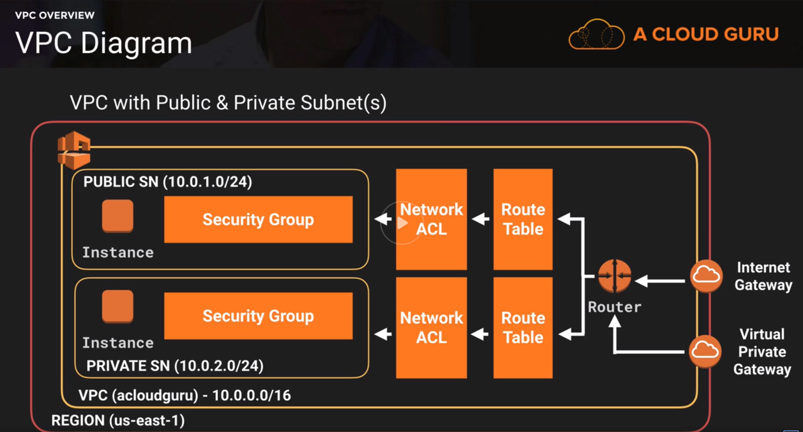
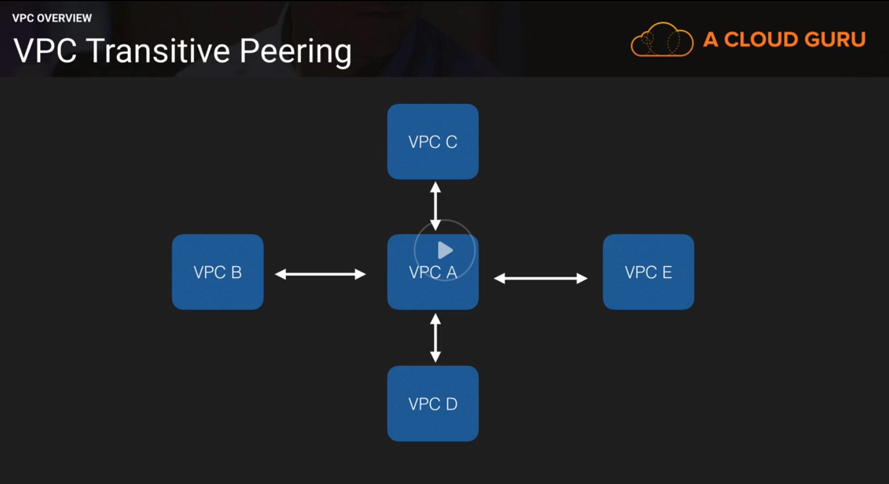
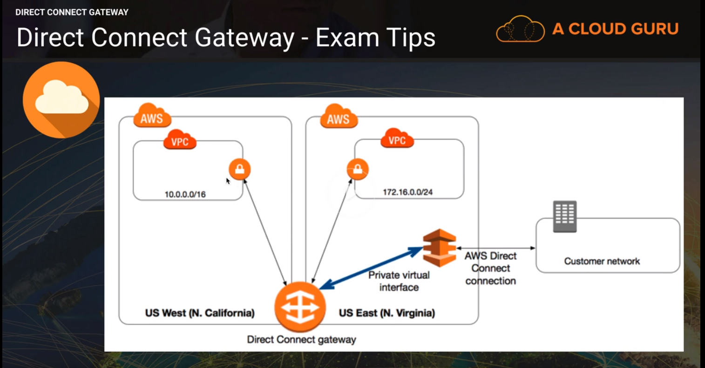

# Networking - VPC

## Overview

- VPC: Virtual Cloud DC
- Logically isolated section of AWS Cloud, where you can launch AWS Resources in a virtual network that you define
- Complete control over:
- - IP Ranges (CIDRs)
- - Subnets
- - Route Tables
- - Network Gateways

[VPC & Network Gateway Connectivity Options](https://docs.aws.amazon.com/whitepapers/latest/aws-vpc-connectivity-options/introduction.html)



### Customization - Security

- Public & Private Subnets (e.g. frontend on public, backend/db on private)
- Security: `Security Groups` & `Network ACLs` (Access Control Lists)
- Can create Hardware VPN connections between on-premises DC & VPC
- Private Subnets only accessible from inside VPC or VPN connections. Example: `Bastion` host on public subnet that connects to instance on private Subnet.
- **!Important** - Usually 1 Subnet - 1 AZ.
- One or more subnets in each Availability Zone. Each subnet must reside entirely within one Availability Zone and cannot span zones.
- You can have multiple subnets on the **same** AZ.

### Internal CIDRs for AWS VPC

[CIDR Calculator](http://cidr.xyz/)

#### AWS VPC Address Ranges

- /28 prefix minimum - 16 Ip addrs
- /16 prefix maximum - 65.536 Ip addrs

- 10.0.0.0 - 10.255.255.255 (10/8 prefix)
- 172.16.0.0 - 172.31.255.255 (172.16/12 prefix)
- 192.168.0.0 - 192.168.255.255 (192.168/16 prefix)

### AWS VPC Capabilities

- Launch Instances into subnets (AZs)
- Custom IP ranges in each subnet
- Configure `Route Tables` between subnets. Route tables define which subnets are allowed to speak with other subnets.
- Create `Internet Gateway` and attach to VPC. Only 1 INGW per VPC. By default are HA - Spread across ALL AZs.
- Security control over AWS Resources.
- Instance `SGs`. You can have SGs span across multiple Subnets - AZs.
- Subnet Network ACLs.
- Security Groups are `stateful`. Network ACLs are `stateless`.
- Create `IGW` or `Virtual Private Gateway` to connect to the outside.

### Default VPC vs Custom VPC

#### Default

- User friendly. Immediately deploy instances.
- All Subnets have route to the internet.
- Each EC2 Instance has both `private` and `public` ip address.

#### Custom

- EC2 instances on private Subnet - only private ip addresses.

### VPC Peering

- Allows you to connect one VPC with another via direct network route using private IP Addresses.
- Resources on one VPC communicate with resource on another VPC.
- You can peer VPC with **other AWS Accounts.** or other VPCs on the same account.
- Peering is in a `Star` configuration. 1 central VPC peers with 4 others. NO Transitive Peering.



## Creating Custom VPC

Auto-created:

- Default Network ACL
- Default SG
- Default Route Table
- No IGW
- No Subnets

### Subnet creation

- Default Scheme: As many subnets as AZs. E.g. eu-west-1 has 3 AZs - 3 Subnets.
- Subnets when created - by default: `Private` - no auto-assign public ip address.
- Naming convention: include AZ in name. (Possibly also include CIDR)
- CIDR: Between `/16` and `/28` netmask. Can be whole CIDR VPC block or subset.
- Any new subnet will be associated by default with the `main default route table`.
- Example 10.0.1.0/24 usually provides 256 addresses. In VPC only 251 available - AWS VPC reserves **special IP addresses.** [Reserved VPC Addresses](https://docs.aws.amazon.com/vpc/latest/userguide/VPC_Subnets.html)

The first __four__ IP addresses and the __last__ IP address in each subnet CIDR block are not available for you to use, and cannot be assigned to an instance. For example, in a subnet with CIDR block 10.0.0.0/24, the following five IP addresses are reserved:

- 10.0.0.0: `Network address.`
- 10.0.0.1: Reserved by AWS for the `VPC router.`
- 10.0.0.2: Reserved by AWS. The IP address of the `DNS server` is always the base of the VPC network range plus two; however, we also reserve the base of each subnet range plus two. For VPCs with multiple CIDR blocks, the IP address of the DNS server is located in the primary CIDR. For more information, see Amazon DNS Server.
- 10.0.0.3: Reserved by AWS for future use.
- 10.0.0.255: `Network broadcast address.` We do not support broadcast in a VPC, therefore we reserve this address.

### Route Table Creation

- Default route table associates all subnets. It is not advisable to grant access to `igw` via `default route-table` as it makes all subnets `public`. Although the above scheme is used in default VPC for convenience.
- To give subnets access to the outside (IGW) you have to add the rule to route table IPv4: `destination: 0.0.0.0/0 target: igw-id` (Same scheme as default VPC) IPv6: `destination: ::/0 target: igw-id`
- Any subnets associated with route-table with route to `IGW` is considered `public`.
- Also choose `Modify auto-assign IP settings` -> `Enable auto-assign public IPv4 address` for subnets associated (public) via IGW route-table.
- Any EC2 Instances launched in public subnet will be publicly accessible. `Security Groups` don't span VPCs. They only exist on specific VPCs.

## Public to Private Instance

- To access an EC2 Instance launched in private subnet from an instance in a public subnet, you have to attach an SG with `inbound rules` that include the public Subnet's CIDR (e.g. `10.0.1.0/24`)
- Never use a `"custom" made bastion host` in production by uploading private ssh key into public instance. Use `Bastion` host instead. See section bastion server with `ssh-agent`.
- Private instance does not have `route out` to the internet and cannot be updated or download - install anything. We can overcome this by creating `NAT Instances` / `NAT Gateways`.

## Bastion server using ssh-agent forwarding

- Start ssh-agent & add identity (key) to account

```Shell
eval $(ssh-agent -s)
ssh-add -k .ssh/test_environ.pem
Identity added: .ssh/test_environ.pem (.ssh/test_environ.pem)
```

- List identities

```Shell
ssh-add -L
```

- Ssh to bastion server with `agent forwarding (-A)`. From there you can ssh to private instances without any private key stored on public bastion server.

```Shell
ssh -A bastion.training
# Connect to private instance
ssh ec2-user@10.0.2.40
```

- SSH directly to private server with one command (`-t` allocates pseudo-terminal)

```Shell
ssh -A -t bastion.training ssh ec2-user@10.0.2.40
```

## NAT Instances / NAT Gateways

### NAT Instances

- Search `nat` AMI on community marketplace e.g. `amzn-ami-vpc-nat-hvm-2018.03.0.20181116-x86_64-ebs`
- Launch in `public` subnet. Attach SG that has inbound rules (e.g. ssh/http/https) to `0.0.0.0/0` `::/0`
- Disable `Source/Destination Checks`
- Add Route to `Default Route Table` with `Destination: 0.0.0.0/0 Target: nat-instance-id`. This way we route out traffic from All subnets via the NAT Instance to the outside.
- You can test outbound traffic, by running updates from a private instance.

> Each EC2 instance performs source/destination checks by default. This means that the instance must be the source or destination of any traffic it sends or receives. However, a NAT instance must be able to send and receive traffic when the source or destination is not itself. Therefore, you must disable source/destination checks on the NAT instance.

[Disable source/destination checks on the NAT instance](https://docs.aws.amazon.com/vpc/latest/userguide/VPC_NAT_Instance.html#EIP_Disable_SrcDestCheck)

- Single NAT Instance, within single AZ, means no failover in case instance dies.
- To overcome this problem we should use `NAT Gateway` instead.
- When NAT Instance is terminated the Route-Table Rule associated with the attached ENI, is considered `black-hole`.

### NAT Gateway

- `NAT Gateways` operate on IPv4
- `Egress only Internet Gateways` operate on  IPv6
- Launch NAT Gateway into **Public** Subnet
- NAT Gateway needs an `Elastic IP`
- Provision time for NAT Gateway: 10-15 minutes. (Has been sped up since tutorial)
- Add route to `Default Route Table` with `Destination: 0.0.0.0/0 Target: nat-gateway-id`
- SGs cannot be associated with NAT Gateway, only resources behind a NAT GW.
- Highly Available. Create a NAT GW in each availability zone.

### NAT Instance - Gateway Comparison

[https://docs.aws.amazon.com/vpc/latest/userguide/vpc-nat-comparison.html](https://docs.aws.amazon.com/vpc/latest/userguide/vpc-nat-comparison.html)

- You can use NAT Instance as `bastion` server. Not supported in NAT Gateway.

### NAT Overview

#### NAT Instance Overview

- Disable source/destination check.
- NAT Instances must be in public subnet
- There must be a route out of the private subnet to the NAT Instance
- Amount of traffic - depends on NAT Instance size.
- HA using auto-scaling groups, multiple subnets in different AZs, and scripts to automate failover.
- Behind SG.

#### NAT Gateway Overview

- Enterprize ready
- Scale automatically up to 10Gbps
- Not associated with SGs.
- No need to patch / maintain
- Automatically assigned public ip address using `Elastic IP`
- Update route tables of private subnet to point to NAT Gateway.
- More secure than NAT Instance.

## Network ACLs (NACL) - Security Groups

### Stateless vs Stateful Filtering

[VPC FAQs](https://aws.amazon.com/vpc/faqs/)

- What is the difference between stateful and stateless filtering?

- __Stateful filtering__ tracks the origin of a request and can automatically allow the reply to the request to be returned to the originating computer. For example, a stateful filter that allows inbound traffic to TCP port 80 on a webserver will allow the return traffic, usually on a high numbered port (e.g., destination TCP port 63, 912) to pass through the stateful filter between the client and the webserver. The filtering device maintains a state table that tracks the origin and destination port numbers and IP addresses. Only one rule is required on the filtering device: Allow traffic inbound to the web server on TCP port 80.

- __Stateless filtering__, on the other hand, only examines the source or destination IP address and the destination port, ignoring whether the traffic is a new request or a reply to a request. In the above example, two rules would need to be implemented on the filtering device: one rule to allow traffic inbound to the web server on TCP port 80, and another rule to allow outbound traffic from the webserver (TCP port range 49, 152 through 65, 535).

### Security Groups

- Security group __rules__ are always __permissive__; you can't create rules that deny access.
- Security groups are __stateful__ — if you send a request from your instance, the response traffic for that request is __allowed to flow in__ regardless of __inbound security group rules__. For VPC security groups, this also means that __responses to allowed inbound traffic__ are allowed to flow out, regardless of __outbound rules__. For more information, see Connection Tracking.
- You can add and remove rules at any time. Your changes are automatically applied to the instances associated with the security group.

### NACL

- You can only associate a subnet to 1 NACL. A subnet cannot be associated with multiple NACLs.
- Rules: Increments of 100 (e.g. rule 100, rule 200 etc.) for IPv4. Starts from `100` for IPv4 and `101` for IPv6
- Default NACL: Allow all Inbound & Outbound.
- When NACL created - by default: Deny All.
- NACLs are stateless, both inbound and outbound have to be defined rules, unlike SGs.
- Rules are evaluated in numerical order. If **rule 100 is allow** and **200 is deny** on same port, **allow** takes precedence.
- NACLs are evaluated before request arrives on SG. If **ssh is denied on NACL** and **allowed on SG**, **ssh is denied**.
- Block IP addresses using NACLs not Security Groups.

## VPC Endpoints

- Use case Private instance upload to S3. Usually done via NAT Gateway using public endpoint. We can point the private instance to use Private Endpoint to S3.
- IAM Role -> Create -> EC2 -> Allows EC2 instances to call AWS services on your behalf. -> Permissions: `AmazonS3FullAccess` -> Attach Role to private EC2 Instance
- Create VPC Endpoint - Types: `Interface`/`Gateway` -> Use S3 Gateway and associate with main `Route Table` (non-public)
- Route Tables get updates automatically to point to `VPC Endpoint`
- **!Important** `DNS resolution` must be **enabled** in your VPC.
- **!Important** To test correctly commands as `aws s3 ls` you have to provide default region with option: `--region` to aws-cli. E.g. `aws s3 ls --region eu-west-1`. Default region is not necessary when you access AWS Resources by using a NAT or Internet Gateway (accessing AWS Resources via public dns).

[https://docs.aws.amazon.com/vpc/latest/userguide/vpc-endpoints.html](https://docs.aws.amazon.com/vpc/latest/userguide/vpc-endpoints.html)

[https://docs.aws.amazon.com/vpc/latest/userguide/vpc-endpoints.html](https://docs.aws.amazon.com/vpc/latest/userguide/vpc-endpoints.html)

## VPC Flow Logs

- Feature to capture IP traffic into and out of the VPC.
- Flow log data is stored using Cloudwatch Logs.
- After flow log is created you can retrieve and view from Cloudwatch.

Flow Logs can be created on 3 levels:

- VPC
- Subnet
- Network Interface

### Create Flow Log

- `Filter`: Type of traffic - accepted, rejected, all
- Create FlowLogs Role
- Upload to Cloudwatch or S3
- You can stream logs to `AWS Lambda` or `Elasticsearch Service`
- You cannot enable flow logs for VPCs peered with your VPC, unless peered VPC is within account.
- You cannot tag a flow log.
- After creation, you cannot edit flow log configuration, e.g. attach a different IAM role.
- Not all traffic is captured
- - Traffic generated by instances contacting `AWS DNS Server`.
- - Windows Instance for Windows License activation.
- - Traffic to and from `169.254.169.254` for instance metadata.
- - `DHCP` Traffic.
- - Traffic to reserved IP Address for default `VPC Router`.

## VPC Clean Up

1. Terminate EC2 Instances.
2. Delete NAT Gateways.
3. Detach IGW - Delete.
4. Delete VPC Endpoints.
5. Release Elastic IPs.
6. Delete VPC (all associated resources e.g. subnets) - SSH KeyPairs remain at regional level.

## CIDR Calculations

- `10.0.0.0/16` Largest address range within VPC - 65536 addresses.
- `10.0.0.0/28` Smallest address range within VPC - 16 addresses.
- Calculate count from netmask - `/24` is 256 addresses. Each increment of one - half the range e.g. `/25` = 128 addresses.
- 2^16 = 65536 = `/16`. 2^8 = 256 = `/24`
- Amazon **always reserves** 4 IP addresses + 1 Broadcast = 5 IP addrs reserved. `/28` = 16 count - 5 reserved = 11 available.

### Cheatsheet

- CIDR: `/16`=65536, `/17`=32768,  `/18`=16384, `/19`=8192, `/20`=4096, `/21`=2048, `/22`=1024, `/23`=512, `/24`=256, `/25`=128, `/26`=64, `/27`=32, `/28`=16
- AWS: `/16`=65531, `/17`=32763,  `/18`=16379, `/19`=8187, `/20`=4091, `/21`=2043, `/22`=1019, `/23`=507, `/24`=251, `/25`=123, `/26`=59, `/27`=27, `/28`=11

## AWS Direct Connect Gateway



- Secure, low-latency connection from on-premises DC to AWS multiple VPCs. Through Private virtual Interface.
- Add route to route table from destination VPC to point to Direct Connect Gateway.
- To connect to multiple VPCs, do not put another direct connection (costly) -> Use `Direct Connect Gateway`.

## ALB

- You will need at least 2 public subnets to deploy an `ALB`
- [Public load-balancer on private-ec2](https://aws.amazon.com/premiumsupport/knowledge-center/public-load-balancer-private-ec2/)
