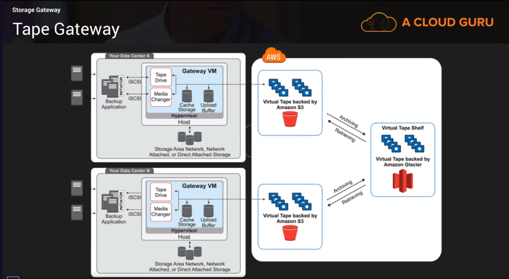

# Storage & Data Management

## Storage - Block, File or Object

[https://help.acloud.guru/hc/en-us/articles/115002011194-AWS-Storage-Types-S3-EFS-EBS](https://help.acloud.guru/hc/en-us/articles/115002011194-AWS-Storage-Types-S3-EFS-EBS)

## S3

### S3 SOS

[S3 FAQs](https://aws.amazon.com/s3/faqs/)

### S3 101

- S3 - Simple Storage Service
- Secure, Durable, highly-scalable __object storage.__
- No FS organization, not suitable for OS or DBs.
- Simple `Key-Value` Store.
- Data is spread across multiple devices & facilities - fully distributed.
- __Unlimited__ storage, object limit is at 5TB
- Files are stored in Buckets (similar to folders)
- S3 is a __universal (global) namespace__, bucket names must be __unique.__ Similar to a DNS name.
- Bucket name example: `https://intelligems-data.s3-eu-west-1.amazonaws.com/` & `https://s3-eu-west-1.amazonaws.com/intelligems-data` are both valid bucket urls, point to the same bucket.
- Upload successful: `200` Response Code

### Data Consistency Model for S3

- `Read after Write` consistency  for `PUTS` of new Objects. File is available to read immediately after upload.
- `Eventual Consistency` for overwrite `PUTS` & `DELETES` (can take some time to propagate). Cases of overwrite and/or delete a file it takes some time to propagate the change around S3.

### S3 Objects

S3 Objects consist of:

- `Key`: Name of the object
- `Value`: Data, as bytes sequence
- `Version ID`: Important for versioning - can keep multiple versions of the same file
- `Metadata`: Data about data you are storing, labels, name of team owns etc.
- `Subresources`: bucket-specific configuration:
- - Bucket `Policies`, `ACLs` - Control Access to objects of a bucket
- - `CORS`
- - `Transfer Acceleration` - accelerate batch uploads of files to S3

### S3 Availability - Durability - Features

- Built for 99.99% availability for S3 Platform - Uptime the S3 service is available
- Amazon __guarantees__ 99.9% `availability`
- Amazon __guarantees__ 99.999999999% (11 x 9s) `durability` for S3 data - amount of data you expect to lose in a year. With 11 x 9s you expect a single object loss every 10.000 years.
- Tiered Storage Available - Different types of data
- Lifecycle Management
- Versioning
- Encryption
- Secure Access - ACLS & Bucket Policies

### S3 Storage Tiers/Classes

- `S3`: 99.99 Availability - 99.999999999 Durability. Data stored redundantly across multiple devices in multiple facilities, can sustain the loss of 2 facilities concurrently.
- `S3-IA`: (Infrequently accessed) For data that is accessed less frequently but required rapid access when needed (on-demand). Lower fee than `S3` but you are charged a retrieval fee. 99.9 Availability
- `S3-One Zone IA`: Same as `S3-IA` but data is stored in `single AZ` only. 99.5 Availability - Same 99.999999999 Durability. Cost is 20% lower than regular `S3-IA`. If you lose a whole AZ you lose access to data until the AZ is back online.
- `Reduced Redundancy Storage`: 99.99 Availability - 99.99 Durability of objects over a given year. Used for non-critical data that can be recreated if lost e.g. thumbnails. Not offered in some regions. Amazon is starting to recommend to not use this storage class & have adjusted the pricing so that standard `S3` is more cost effective to `RRS`.
- `Glacier`: Very cheap, but used for archiving only. Optimised for data that is infrequently accessed and not readily available. Takes 3-5 hours to restore from `Glacier`.


- `S3 - Intelligent Tiering`: Announced at `reInvent 2018`
- - Uknown or unpredictable access patterns
- - 2 tiers - frequent & infrequent access
- - Automatically moves data (per object) to most cost-effective tier, based on object access frequency.
- - If an object is not accessed for __30__ consecutive days, it is automatically moved to the IA tier.
- - As soon as an object that lives in IA is accessed it is automatically moved in the frequent access tier.
- - Same availability - durability to standard `S3-IA`
- - No fees for accessing your data (like in `S3-IA`) but small monthly fee for monitoring/automation - $0.0025 per 1000 objects.

### S3 Charges

- Storage per GB
- Number of Requests (Get, Put, Copy etc.)
- Storage management pricing:
- - Inventory
- - Analytics
- - Object Tags
- Data management pricing:
- - Free to store data __in__ S3
- - Data transfered __out__ of S3 - e.g. downloads
- Transfer acceleration: Use of `Cloudfront` to optimize transfers

> Please read before exam [AWS S3 FAQS](https://aws.amazon.com/s3/faqs/)

### S3 Lab

#### Configure Options

- `Bucket Name`: DNS Compliant name
- `Versioning`: keep multiple versions of the same object in the same bucket - protects from accidentally overwriting objects
- `Server Access Logging`: Allows to log all access requests to the __bucket__. Logs are saved in S3 bucket within the same region, accumulate very quickly (Access Logs). You can add `lifecycle rules` for log files such as retention period.
- `Object Level Logging`: Allows to log __object__ level access request (API) using `CloudTrail`. Additional cost required.
- `Tags`: Track project cost by grouping by project, department or environment tags.
- `Default Encryption`: S3 automatically encrypts objects when they are stored in S3. Options `AWS-KMS` using a `KMS` master key or `AES-256` with Amazon-S3 managed keys. Default Encryption is `At Rest`. `In Transit` encryption is achieved using SSL/TLS (HTTPS S3 urls).
- `Cloudwatch Request Metrics`: Monitor requests to S3 bucket. Additional cost.

#### Public Access Settings

- By default all __public__ access is completely blocked. (All block options selected)
- If the above options are set to blocked, whenever you upload an object even read access is denied via a browser url. However if the owner of the object accesses it via API or CLI with his  access/secret keys he has read/write access.
- To change above behaviour (e.g. for website static content - images, js etc.) you can use `make public` option from console or when uploading programmatically enable a read access ACL `--acl public-read`

```Bash
# aws cli upload a folder recursively with objects allowed public read
AWS_ACCESS_KEY_ID=${AWS_ACCESS_KEY_ID} \
AWS_SECRET_ACCESS_KEY=${AWS_SECRET_ACCESS_KEY} \
AWS_DEFAULT_REGION=${AWS_DEFAULT_REGION} \
aws s3 cp ./dist/ s3://${S3_BUCKET_NAME} --recursive --acl public-read
```

### S3 Lifecycle Policies

- You can use `S3 Lifecycle Management` to manage objects so they are stored using the most cost-effective S3 option throughout their lifecycle.
- Use cases: transition objects to less expensive storage classes, archive them or delete them.
- Best for objects that have a __well defined lifecycle__ e.g. log files, not so useful after they reach a certain age.
- Lifecycle rules are based on __object creation date.__

#### Example lifecycle policies

- Transition objects to an `IA` storage class 90 days after creation, e.g. transaction log files.
- Archive objects to `Glacier` 1yr after creation.
- Configure objects to `expire` 1 yr after creation - S3 will __auto-delete__ expired objects.
- Use Case: Buckets with `Server Access Logging` (S3 feture) can accumulate a lot of log files over time.

### MFA Delete & S3 Versioning

#### Versioning

- S3 Versioning enables to revert to older S3-object versions.
- Multiple versions of an object are stored in the same bucket.
- Protects you from accidental delete/overwrite
- With versioning enabled, a `DELETE` request does not delete the object, it applies a delete marker instead. To remove the marker is to __undelete__ the file (restore version)
- To permanently delete, provide the object's `Version ID` in the `DELETE` request.

#### MFA Delete

- Provides an additional layer of protection to S3 Versioning.
- You can use same MFA device as with logging in to AWS Console.
- Once enabled, MFA Delete will enforce 2 things:
- - Valid code from MFA Device to permanently delete an object version.
- - MFA code also needed to __suspend / re-activate versioning__ on an S3 Bucket.

### S3 Encryption

#### Types of encryption

- `In Transit`: SSL/TLS - During upload/download of objects to/from a bucket.
- `At Rest`: Server Side encryption types:
- - S3 Managed Keys - `SSE-S3` - each object encrypted with its own unique key. The key itself is encrypted with a Master Key (regularly rotated) `AES-256` algo.
- - AWS `KMS` - `SSE-KMS` - `Envelope Key` is used to encrypt the `KMS` key that encrypts your data. Also adds an __audit trail on key usage logs.__
- - Customer provided keys - `SSE-C` - User is responsible for key security and management. User responsibility.
- Client Side encryption - Encrypt the files yourself before upload. User responsibility.

#### Enforcing encryption on S3 Buckets

- Every time a file is uploaded, a `PUT` request is initiated.
- Example:


- `Expect: 100-continue` tells S3 to not send request until it receives an `ACK`. S3 can reject message based on Header content.
- If the file is to be encrypted (at Rest) at upload time, the `x-amz-server-side-encryption` parameter will be included in the request Header.
- Two options available:
- - `x-amz-server-side-encryption: AES-256` - `SSE-S3`
- - `x-amz-server-side-encryption: ams:kms` - `SSE-KMS`
- When parameter exists, S3 is told to encrypt the object using specified encryption method.
- You can enforce the use of server side encryption, by using a `Bucket Policy` that rejects `PUT` requests without the `x-amz-server-side-encryption` Header parameter.


> __Important!__ ["To change the encryption of an existing object to SSE-KMS, you must re-upload the object. Or, you can copy the object over itself."](https://aws.amazon.com/premiumsupport/knowledge-center/s3-existing-objects-default-encryption/)

#### S3 Encryption Lab using an S3 Bucket Policy

- AWS Console: `Permissions` -> `Bucket Policy`
- Using `Policy Generator`:
- - `S3 Bucket Policy` type
- - `Effect`: `Deny`
- - `Principal`: `*` (any request)
- - `AWS Service`: `Amazon S3`
- - `Actions`: `PutObject`
- - `ARN`: `arn:aws:s3:::<bucket-name>`, example: `arn:aws:s3:::encryption-test-intelligems`
- - `Condition`: `StringNotEquals`
- - `Key`: `s3:x-amz-server-side-encryption`
- - `Value`: type of encryption, example `aws:kms`
- `Add Statement`

```JSON
// Deny S3 PUT Requests without Encryption - AWS Policy

{
  "Id": "Policy1565345278475", // Those IDs are auto-generated from Policy Generator
  "Version": "2012-10-17",
  "Statement": [
    {
      "Sid": "Stmt1565345257483", // Those IDs are auto-generated from Policy Generator
      "Action": [
        "s3:PutObject"
      ],
      "Effect": "Deny",
      "Resource": "arn:aws:s3:::encryption-test-intelligems",
      "Principal": "*"
    }
  ]
}
```

- When applying the policy: `Error Action does not apply to any resource(s) in statement`
- The above is resolved by adding a wildcard `*` after the resource name, to apply the action to all subresources. Example: `"arn:aws:s3:::encryption-test-intelligems/*"`
- To test upload a file without and with encryption (`Set properties` section from S3 Console Upload) with correct selected and not selected encryption method.

## EC2 Volumes

### EC2 Volume Types - EBS vs Instance Store (Ephemeral Storage)

#### Types of Volumes

- `Root volume` - OS residence
- `Additional volumes` - (`D:\`, `E:\`, `F:\` or `/dev/sdb`, `/dev/sdc` etc.)

#### Root Volume Sizes

- Root device volumes can be either `EBS` or `Instance Store` volumes
- `Instance Store` volume max size: `10 Gb`
- `EBS` volume max size: up to `1 or 2 Tb` depending on the OS choice.

#### EBS Termination

- `EBS root device` Volumes are terminated __BY DEFAULT__ when an EC2 instance is terminated. You can change the setting by unselecting `Delete on Termination` option in console __only__ at instance creation or by setting the `deleteontermination` flag to `false` using the CLI
- Other `EBS` volumes attached to the instance are preserved when you terminate the instance.

#### Instance Store Termination

- `Instance Store root device` Volumes are terminated __BY DEFAULT__ when an EC2 instance is terminated. You cannot stop this.
- Other `instance store` volumes attached will be __deleted__ automatically on termination.
- Other `EBS` volumes attached will __persist__ automatically on termination.

#### Stopping an Instance

- `EBS` backed instances can be stopped.
- `Instance Store` backed instances can't be stopped. Only rebooted or terminated.

#### Instance Store Data

- __Reboot__: Intentinally or unintentionally instance store data are __persisted__
- Instance Store data are lost when:
- - __Failure of Drive__
- - __Stopping an EBS-backed instance__ (Instance store volumes co-exist with `EBS`)
- - __Terminating instance__
- __Do not__ rely on Instance Store volumes for valuable, long-term data. Instead keep safety by using a data replication strategy across:
- - Multiple instances
- - `S3`
- - `EBS` volumes
- - `EFS`
- __Important!__ If Instance Store you cannot upgrade kernel, instance type etc. Instance is fixed for it's lifetime.


#### Benefits Instance Store vs EBS

- Instance store is ideal for temporary storage and is faster as it's a directly attached volume to your instance. Also more cost-effective.
- EBS is persistent, can be encrypted, can be backed up with snapshots, can be detached and reattached to a new instance.

### Upgrade EC2 Volumes Lab

#### 1. Lab Setup: EC2 Instance with volumes attached

|Device|EBS Type|Root|
|--|--|--|
|`/dev/xvda`|`gp2`|__Yes__|
|`/dev/sdb`|`standard`|No|
|`/dev/sdc`|`st1`|No|
|`/dev/sdd`|`sc1`|No|

- `EBS` volumes attached to instance reside in the same `AZ` as of the EC2 instance.
- __Exam Tip__ `EBS` have to be in the same `AZ` with the `EC2` instance to be mounted.
- `Root Device Volume` is always based on a snapshot (with `snapshot-id`)
- `SSD` Types (Now also `HDD` Types): `Actions` -> `Modify Volume` on the fly (running state) with __no downtime__ - modify type (`gp2` to `io1`) or size, and __no requirement to stop the instance.__
- Volume size upgrades need some OS steps (commands) to be read correctly from the FS.

#### 2. Create `EC2` copy in another `AZ` or `Region`

- `Create snapshot` (e.g. of root device - `gp2`)
- `Create volume` from snapshot - Change volume type and `Availability Zone`
- Attach created volume to an `EC2` instance in that new `AZ`
- `Copy snapshot` action will allow to copy a snapshot to a different `Region` & create a volume to the other Region from the snapshot __copy__ or `Create Image from snapshot` bootable for `EC2`.
- `Create Image from snapshot` allows to create an `AMI` and boot EC2 instance from it.
- [EBS Copy to other Region](https://acloud.guru/forums/aws-csysops-2019/discussion/-LjwlXjdIhrWCcrUm4TT/to_move_a_ebs_volume_from_1_re)

### Snapshots

- `Snapshots` exist on `S3` - just not viewable on `S3` service as user.
- `Snapshots` are point in time copies of volumes.
- `Snapshots` are incremental - only __blocks that have changed__ since your last snapshot are moved to S3.
- If it the __first__ `Snapshot` it takes some more time to create.
- To create `Snapshot` for EBS root device, you __should stop__ the EC2 instance first, as a best practice. You can take a `Snapshot` while instance running.
- You can create `AMIs` from both `Images` & `Snapshots`.
- `Snapshots` of encrypted volumes are __encrypted automatically.__
- Volumes restored from encrypted `Snapshots` are __encrypted automatically.__
- You can __share__ `Snapshots` with other users, only if they are __unencrypted.__ Other AWS accounts or public.

#### Snapshot EBS on RAID Array

[https://aws.amazon.com/premiumsupport/knowledge-center/snapshot-ebs-raid-array/](https://aws.amazon.com/premiumsupport/knowledge-center/snapshot-ebs-raid-array/)

### RAID Configurations

[https://docs.aws.amazon.com/AWSEC2/latest/UserGuide/raid-config.html](https://docs.aws.amazon.com/AWSEC2/latest/UserGuide/raid-config.html)

### Encryption & Downtime

- For most AWS resources, encryption can __only__ be enabled at __creation__
- `EFS` - Only way to encrypt an `EFS` that already exists: Create new `EFS` & migrate your data.
- `RDS` - Same as `EFS` above. Migrate Data to new encrypted `RDS`
- `EBS` Volumes - Encryption must be enabled at creation time: Cannot encrypt an unencrypted volume, or unencrypt an encrypted volume. Solution 1: Migrate data between volumes using `rsync` or `Robocopy` (windows).
- Solution 2: If you want to encrypt an existing `EBS` volume:
- - Create snapshot
- - Copy snapshot & apply encryption at the same time -> __Encrypted Snapshot__
- - Restore to new encrypted volume from encrypted snapshot
- `S3` - You can enable encryption at __any time__. No impact on applications (no downtime)
- `S3 Objects` - You can enable encryption on objects at __any time__
- Migrating your data you may need to stop application for some time (downtime)

### KMS vs CloudHSM

- Both allow to generate, store and manage __cryptographic keys__
- `HSMs` (Hardware Security Modules) are used to protect confidentiality of keys - Used in both `KMS` & `CloudHSM` under the hood - Physical device, often used in fin payment systems, PKI, Credit Card etc.
- Both offer high level of security

#### KMS

- Shared hardware (`HSMs`), multi-tenant managed service
- Suitable for applications where multi-tenancy is not an issue, due to restrictions, regulatory requirements or compliance about sharing `HSMs` with other users
- Free-tier eligible
- Encrypt data stored in AWS including `EBS` Volumes, `RDS`, `S3`, `DynamoDB` etc.
- Only uses __symmetric__ keys - same algorithm + key to encrypt and decrypt.

#### CloudHSM

- Dedicated `HSM` instance
- No Free-tier
- HSM is under your exclusive control within your own `VPC`
- `FIPS 140-2 Level 3` compliance (US gov for `HSMs`, highest `Level 4`) - includes tamper-evident physical security mechanisms
- Suitable for applications with contractual or regulatory requirements for dedicated hardware managing cryptographic keys
- Use cases: database encryption, Digital Rights Management (`DRM`), Public Key Infrastructure (`PKI`), authentication/authorization, document signing, transaction processing etc.
- `Symmetric` or `Asymmetric` encryption


## AMIs

- `Amazon Machine Image` - Provides all information needed to launch `EC2` instances.
- Provides:
- - __Template for the root volume__ (OS, Applications)
- - __Launch permissions__ - which AWS accounts can use the AMI to launch instances. Public, Private or shared with specific AWS Accounts.
- - __Block device mapping__ to specify `EBS` volumes to attach to the instance at launch time.
- `AMIs` registered on a per-region basis. You need to __copy__ registered `AMI` on `us-east-1` to `eu-west-1` to launch instances on `eu-west-1`.
- AWS provides a selection of default `AMIs` with different flavours.
- Create custom `AMI` (Process is automated with `Packer`, uses ephemeral `EC2` instances and `SSH` keys):
- - Launch an instance from existing `AMI` as base
- - Connect to instance & customize (install apps, copy data, configuration changes etc.)
- - Create custom `AMI` image from instance.
- - Your `AMI` must be registered before it can be used to launch an image.

### Sharing AWS AMIs

- Private (default)
- Public
- share with specified list of AWS accounts
- Sell
- The sharing account still has __control & ownership__ of the `AMI` and is __charged__ for storage (`S3` under the hood) of the `AMI` in theis account.
- Copying `AMI`: the __owner__ of the source `AMI` must grat read permissions for storage that backs ths `AMI` (`EBS` snapshot or `S3`)
- If you __copy__ an `AMI` that was shared with you, you are the __owner of the copy__ and will be __charged for storage in the destination region__.
- You cannot directly copy an __Encrypted `AMI`__ shared by another account:
- - Method: Copy the __snapshot__ and re-encrypt using your __own key__.
- - The sharing account must also __share__ with you the __underlying snapshot & encryption key__ used to create the `AMI`.
- - You'll own the __copied snapshot__ and can register it as a new `AMI`.
- `billingProducts` code is used to bill for the use of an `AMI` .e.g. a small fee is included to cover Windows Server or SQL Server licence.
- You cannot directly copy an `AMI` with an associated `billingProducts` code (applied to Windows, RedHat and `AMIs` from AWS Marketplace, basically products with a licence fee/subscription fee/monthly fee)
- Launch an `EC2` instance using the shared `AMI` with the above conditions and create a new `AMI` from the instance.

## Snowball - Snowball Edge

- Physical device used to transport TB or PB of data, in& out of AWS.
- Makes __large scale data transfers__ fast, secure & easy.
- __Tamper-resistance__ enclosure. 256-bit encryption.
- __Region specific__, not for transfering data from one region to another.

### How it works

- Connect the device to your local network
- Snowball client automatically encrypts & copies the data you select into Snowball
- When transfer is complete, the device is shipped back to Amazon. Track the progress of shipping. Opt to receive `SNS Notification` on arrival.

### When to use Snowball

- Many TB or PB to upload.
- Don't want to make expensive upgrades to network for a one-off data transfer.
- Frequently experience backlogs of data.
- You're in a physically isolated environment, high-bandwidth is not available or cost-prohibited.
- If it takes more than a week to upload your data.

### Snowball Edge

- 100TB device, which also features onboard __compute__ power and can be __clustered__ as a single __storage & compute pool__.
- Designed to undertake some local processing / edge computing, as well as data transfer.
- `S3-compatible endpoint`, supports `NFS` & can also run `Lambda` functions as data is transfered to the device.
- `S3` buckets & `Lambda` functions come pre-configured on the device.
- Use Snowball Edge if you need to process the data locally, before returning the device to AWS.

## Storage Gateway

- Consists of an __on-premises software appliance__, which connects with AWS Cloud-based storage.
- Seamless, secure integration between on-premises IT environment and AWS.
- `Storage Gateway Virtual Appliance` is installed in your data center.
- Supports `VMWare ESXi` or `Microsoft Hyper-V`
- Seamlessly Integrate with AWS Storage e.g. `S3`. For your systems it seems like the storage is on-site.
- Connect using `NFS`, `SMB` or `iSCSI`

### Types of Storage Gateway

- File Gateway `NFS` (Unix/Linux) / `SMB` (Windows) - Network access storage
- Volume Gateway `iSCSI`
- - Stored Volumes
- - Cached Volumes
- Tape Gateway `VTL` - Virtual Tape Library - Integrate your backups with AWS

#### File Gateway

- __Flat Files__ stored as objects in your `S3` buckets
- Accessed using `NFS`/`SMB` mount point
- To your on-premises systems, appears like a file system mount, backed by `S3`
- All the benefits of `S3`: Policies, Versioning, Replication, Lifecycle Management
- Low-cost alternative to on-premises storage


#### Volume Gateway

- Provides Cloud backed storage accessed using `iSCSI` protocol.
- `Gateway Stored Volumes`
- - Store all your data locally & only backup in AWS.
- - Low-latency access to the entire dataset.
- - You need your own storage infra (`NAS`, `SAN`)
- - Provides durable off-site __async__ backups in the form of `EBS` snapshots, stored in `S3`.


- `Gateway Cached Volumes`
- - Use `S3` as your primary storage & cache frequently accessed data in your Storage Gateway
- - Only need enough local storage capacity to store frequently accessed data & not whole dataset.
- - Low-latency access without the cost of on-premises storage infra.


#### Tape Gateway

- Virtual Tape Library, provides cost-effective data archiving in the cloud, using `Glacier`
- No need to invest in own tape-backup infra.
- However integrates with existing tape backup infra - `NetBackup`, `Backup Exec`, `Veeam` which connects to `VTL` using `iSCSI`.



## Athena

[Athena CLI Reference](https://docs.aws.amazon.com/cli/latest/reference/athena/)

- Is an interactive __query service__, enables to analyze and query data located in `S3` using standard `SQL` queries.
- __Serverless__ (database interface), nothing to provision. Pay per query / per TB scanned.
- No need to setup complex Extract/Transform/Load `ETL` processes.
- Works directly with data stored in `S3`

### Athena Use Cases

- Log files stored in `S3`, e.g. ELB logs, Cloudtrail logs, S3 Access Logs etc.
- Generate business reports with data stored in `S3`
- Analysis of `AWS` __Cost & Usage__ reports
- Run queries on __click-stream data__ (e.g. user activity / behaviour)

### Athena Lab - Query Cloudtrail Audit Logs

- Setup `S3` Access Logs in a Trail (from `CloudTrail` service).
- `Analytics` -> `Athena` -> `New Query`

```SQL
CREATE DATABASE myathenadb
```

- `Run Query`
- Populate database with tables - create `cloudtrail_logs` table

```SQL
CREATE EXTERNAL TABLE cloudtrail_logs (
eventversion STRING,
useridentity STRUCT<
               type:STRING,
               principalid:STRING,
               arn:STRING,
               accountid:STRING,
               invokedby:STRING,
               accesskeyid:STRING,
               userName:STRING,
sessioncontext:STRUCT<
attributes:STRUCT<
               mfaauthenticated:STRING,
               creationdate:STRING>,
sessionissuer:STRUCT<
               type:STRING,
               principalId:STRING,
               arn:STRING,
               accountId:STRING,
               userName:STRING>>>,
eventtime STRING,
eventsource STRING,
eventname STRING,
awsregion STRING,
sourceipaddress STRING,
useragent STRING,
errorcode STRING,
errormessage STRING,
requestparameters STRING,
responseelements STRING,
additionaleventdata STRING,
requestid STRING,
eventid STRING,
resources ARRAY<STRUCT<
               ARN:STRING,
               accountId:STRING,
               type:STRING>>,
eventtype STRING,
apiversion STRING,
readonly STRING,
recipientaccountid STRING,
serviceeventdetails STRING,
sharedeventid STRING,
vpcendpointid STRING
)
ROW FORMAT SERDE 'com.amazon.emr.hive.serde.CloudTrailSerde'
STORED AS INPUTFORMAT 'com.amazon.emr.cloudtrail.CloudTrailInputFormat'
OUTPUTFORMAT 'org.apache.hadoop.hive.ql.io.HiveIgnoreKeyTextOutputFormat'
-- Location of s3 bucket url
LOCATION 's3://mycloudtrailbucket-faye/AWSLogs/757250003982/';
```

- Query data

```SQL
SELECT
 useridentity.arn,
 eventname,
 sourceipaddress,
 eventtime
FROM cloudtrail_logs
LIMIT 100;
```

### AWS S3 Select vs Athena

- You can think about `AWS S3 Select` as a cost-efficient storage optimization that allows retrieving data that __matches the predicate__ in `S3` and `glacier` aka push down filtering.
- `AWS Athena` is fully managed analytical service that allows running arbitrary ANSI SQL compliant queries - group by, having, window and geo functions, SQL DDL and DML.

### S3 Select

- `S3 Select` makes it easy to retrieve specific data from the contents of an object using simple SQL expressions. There is __no need to retrieve the entire object.__
- At present, there is no charge for using `S3 Select` while it is in preview, and there is no definition of pricing. However, you will need to apply at the reference.
- While in preview `S3 Select` supports CSV, JSON, and Parquet files with or without GZIP compression. During the preview __objects that are encrypted at rest are not supported__.
- Because `S3 Select` is still in preview, AWS doesn't have internal cases to verify how the service is being used.

## EFS

- `EFS` is an `NFS` Storage system for `EC2`. Storage capacity is elastic, growing and shrinking automatically, so applications have the storage they need, when they need them - no need to pre-provision.
- You cannot mount `EBS` volumes on __multiple EC2 Instances__. You can have __multiple EC2 Instances__ share an `EFS` though.
- Best / __Easier__ way to __share__ filesystem/folders between `EC2` Instances - __Distributed Storage__
- You can have __Lifecycle Policies__ with `EFS` too, move files to `EFS IA` (Infrequent Access)
- Throughput Mode: Bursting (on-demand), Provisioned (high throughput needs known beforehand)
- Performance: General Purpose, Max I/O
- Encryption of Data at Rest (only on creation, needs __migration__ to apply later)
- Adjust EFS `SGs` to accept inbound `NFS` protocol - port `2049` from `EC2` Security Groups.
- __HA__ with multiple mount targets on multiple `AZs` - on same Region
- Can support thousands of __concurrent `NFS` connections__ & scale up to __Petabytes__
- __Read after Write Consistency__ - Instantly accessible

### Mount EFS with encryption in transit

- Mount instructions exist: for __local `VPC`__ across __`VPC` Peering Connections__ & __on-premises__
- `Amazon 2 Linux` using the `EFS` helper utils

```Bash
sudo yum update -y
sudo yum install amazon-efs-utils -y

# Create mount directory
mkdir -p efs-dir
sudo mount -t efs -o tls fs-9816b269:/ efs-dir

# Without the efs helper, also use the amazon mount instructions
sudo mount -t nfs4 -o <follow aws options helper link> <full fs-id.url>:/ efs-dir

# If mount command hangs for over a minute, then the SG are not working (timeout)
```
