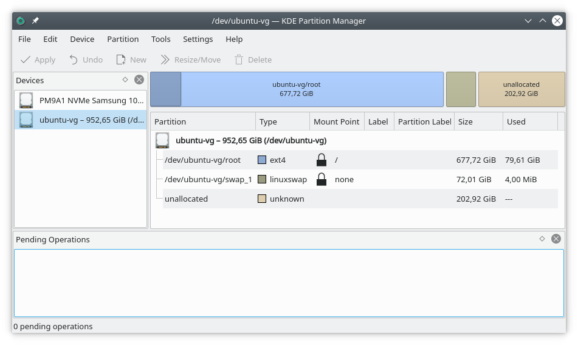

# The Job Hopper

Useful onboarding instructions and how-to guides for "job-hopping" Linux workstations.
This guide is meant to be followed top to bottom, skipping the parts you may not need.

- [The Job Hopper](#the-job-hopper)
  - [Change Passwords](#change-passwords)
    - [Disk Encryption](#disk-encryption)
    - [User Password](#user-password)
  - [Backup and Adjust Partition Size](#backup-and-adjust-partition-size)
    - [Create, Boot Kubuntu Live Image](#create-boot-kubuntu-live-image)
    - [Backup](#backup)
    - [Repartition](#repartition)
  - [Basic System Tweaks](#basic-system-tweaks)
    - [Improve Battery Life](#improve-battery-life)
    - [Sleep Issues](#sleep-issues)
    - [Enable Hibernation](#enable-hibernation)
    - [Random Freezes](#random-freezes)
    - [Install System Tools](#install-system-tools)
  - [Other System Tweaks - Optional](#other-system-tweaks---optional)
    - [Install default KDE](#install-default-kde)
    - [Install Kubuntu Latest KDE](#install-kubuntu-latest-kde)
    - [Firmware Update](#firmware-update)
    - [Yubikey Authentication](#yubikey-authentication)
    - [AptX (Bluetooth HQ Audio)](#aptx-bluetooth-hq-audio)
    - [Mount /tmp on tmpfs](#mount-tmp-on-tmpfs)
    - [Solve Ubuntu SystemD Issues](#solve-ubuntu-systemd-issues)
  - [Install Productivity Tools](#install-productivity-tools)
    - [Chrome](#chrome)
    - [Zoom](#zoom)
      - [Via Deb](#via-deb)
      - [Via Snap](#via-snap)
      - [Tools for Zoom](#tools-for-zoom)
    - [Slack](#slack)
      - [Via Deb Package](#via-deb-package)
      - [Via Snap Package](#via-snap-package)
    - [OpenVPN](#openvpn)
    - [OpenVPN3 - Terminal](#openvpn3---terminal)
      - [OpenVPN3 Installation](#openvpn3-installation)
      - [OpenVPN3 Usage](#openvpn3-usage)
    - [Printunl Client - VPN](#printunl-client---vpn)
    - [Screenrecorder - Pass](#screenrecorder---pass)
  - [Install Development Tools](#install-development-tools)
    - [Common](#common)
    - [VsCode](#vscode)
    - [Docker CE \& Tools](#docker-ce--tools)
      - [Docker CE](#docker-ce)
      - [Docker Compose Standalone](#docker-compose-standalone)
      - [Lazydocker](#lazydocker)
    - [Version Managers](#version-managers)
      - [`asdf` - CLI Tools Version Manager](#asdf---cli-tools-version-manager)
      - [`nvm` - Node Version Manager](#nvm---node-version-manager)
      - [`gvm` - Go Version Manager](#gvm---go-version-manager)
      - [`pyenv` - Python virtualenvs and versions](#pyenv---python-virtualenvs-and-versions)
    - [Use shell python version - Set or show the global Python Version](#use-shell-python-version---set-or-show-the-global-python-version)
      - [`tfenv` - Terraform Version Manager](#tfenv---terraform-version-manager)
    - [`chezmoi` - Dotfile management](#chezmoi---dotfile-management)
    - [ASDF Packages](#asdf-packages)
      - [Kubernetes Tools](#kubernetes-tools)
  - [Developer Tweaks](#developer-tweaks)
    - [Global .gitconfig](#global-gitconfig)
    - [Bash completion](#bash-completion)
    - [GPG Agent](#gpg-agent)
    - [SSH Agent](#ssh-agent)
    - [Verify Jenkinsfiles](#verify-jenkinsfiles)
    - [Terminal and Editor customization](#terminal-and-editor-customization)
      - [Terminator Themes](#terminator-themes)
      - [Terminator Profile settings](#terminator-profile-settings)
      - [Bash Git Prompt](#bash-git-prompt)
      - [Vim Colorschemes](#vim-colorschemes)
      - [K8s Prompt](#k8s-prompt)
      - [Jetbrains Toolbox](#jetbrains-toolbox)
      - [AWS Profiles](#aws-profiles)

## Change Passwords

### Disk Encryption

To change the disk encryption passphrase:

```bash
sudo cryptsetup luksChangeKey /dev/nvme0n1p3
```

To add a second passphrase, keeping the old one:

```bash
sudo cryptsetup luksAddKey /dev/nvme0n1p3
```

### User Password

To change your user's password:

```bash
passwd
```

## Backup and Adjust Partition Size

> This section is optional and may be dangerous; if you do not pay attention
you may format your disk(s).

The laptop comes with almost the whole disk formatted as a single partition and
a tiny swap partition. Some people might need a larger swap partition in order
to __enable hibernation__, or want to have some unallocated space available they can
later use as they see fit.

[Check Swap Size](https://www.cyberciti.biz/faq/linux-check-swap-usage-command/)

### Create, Boot Kubuntu Live Image

The easiest way to repartition is to use KDE's partitionmanager as it can work
on all devices and not just physical ones. In our case our device is the volume
group (VG) stored in the large encrypted partition.

[Download the Kubuntu LTS image.](https://kubuntu.org/getkubuntu/)

Once you have the ISO, the easiest path is to write it to a USB flash drive.

> The contents of the drive will be deleted in the process. We will format it!

If you are on a Linux machine, use `ddrescue`. Plugin your USB flash drive,
check with `dmesg` its disk descriptor (something like `/dev/sdX`), verify with
`fdisk -l /dev/sdX` to make sure you got the correct drive. You can also check
under `/dev/disk/by-id` to find it with a more descriptive name. E.g:
`/dev/disk/by-id/usb-Kingston_DataTraveler_3.0_00190F0C02A9BW32A67E4211-0:0`.

Now write the image:

```bash
ddrescue -v -f -D /path/to/kubuntu-20.04.2.0-desktop-amd64.iso /dev/sdX
```

Reboot your computer. During boot press __F12__ to enter the boot menu and
select the USB key. Once you are in Kubuntu, select the option to try Kubuntu,
__do not select install__.

### Backup

It is always a good idea to take a backup now. If you have an external disk, connect
it to your laptop.

Open a terminal, mount your disk and take a backup. The backup should take
around 30-50GB of space and less than an hour, as we use pigz to compress the
image using all cores.

```Shell
# Flash drive is on /dev/sdY
mount /dev/sdY /mnt
apt update
apt install pigz pv
# On some systems boot partition is on nvme0n1p1 and root on nvme0n1p3
pv -pterab /dev/nvme0n1p3 | pigz --processes 6 --stdout > /mnt/laptop-backup.img
sync # This can take quite long if you used a flash drive for the backup
umount /mnt
```

### Repartition

Once your backup is ready, run the KDE Partition Manager (`partitionmanager`).
Select the Ubuntu VG and do the steps in the following order:

1. Resize `/dev/ubuntu-vg/root`
2. Resize `/dev/ubuntu-vg/swap_1`

Do not do any more steps. If you are not sure, press undo and complete
everything in two steps. Then press apply.

The choices are completely personal. I resized my root to 677GB which I think
are enough, then resized the swap to 72GB so I can enable hibernation on it. I
left 202GB unallocated which I can later add them back to root, or create new
partitions, such as a `BTRFS` partition to more efficiently store docker images.



Once ready reboot your computer.

## Basic System Tweaks

### Improve Battery Life

Install and enable TLP:

```bash
sudo apt install tlp tlp-rdw
sudo tlp start
```

Optionally edit `/etc/tlp.conf` to tweak settings.

### Sleep Issues

Dell's latest laptops do not seem to support deep sleep on Linux —known as S3
state. As a consequence, putting our laptop to sleep, means it stays a bit warm
and eats battery at a much higher rate than usual (12%-24% during a night's
sleep).

If you try to enforce S3 sleep, your computer will not be able to come back from
sleep and you will have to force power it off by keeping the power button
pressed.

Thus the solution is to use hibernation instead for when you need your computer
to stay asleep for more than a few hours.

### Enable Hibernation

During hibernation your computers stores the RAM contents on disk (inside the
swap) then powers off. To hibernate, your computer needs a swap file larger than
your memory. In our case our memory is 64GB, so our swap should be over 64GB. I
recommend 72GB.

If you followed the repartition guide, you already have a large enough swap
space. If you do not want to repartition, you can use a file instead. I have
only tested the swap partition, so I will only describe how to enable
hibernation via a swap partition. You can find resources on the internet on how
to use a file for swap.

Start by finding the UUID of your swap partition. Run the command `blkid` to do
that, like in the example below:

```bash
$ blkid
/dev/mapper/nvme0n1p3_crypt: UUID="b659c5a3-0882-4a8f-a609-dfd656159257" TYPE="LVM2_member"
/dev/mapper/ubuntu--vg-swap_1: UUID="973b0396-303f-4159-b2fe-ea6d42a6497b" TYPE="swap"
/dev/mapper/ubuntu--vg-root: UUID="894e5175-2267-4600-b4cc-0a5bf3f29851" TYPE="ext4"
```

In the example output the swap UUID is `973b0396-303f-4159-b2fe-ea6d42a6497b`.

Edit `/etc/default/grub` and find the line starting with
`GRUB_CMDLINE_LINUX_DEFAULT`. There add the entries
`resume=UUID=[UUID-WE-JUST-FOUND] nmi_watchdog=0`. In the end this line should
look a lot like this:

```Shell
GRUB_CMDLINE_LINUX_DEFAULT="quiet splash resume=UUID=973b0396-303f-4159-b2fe-ea6d42a6497b nmi_watchdog=0"
```

Then update grub with the new settings:

```bash
sudo update-grub
```

To permit screen managers and desktop environments to hibernante the machine,
add a polkit rule by running the command below:

```bash
cat << "EOF" > /etc/polkit-1/localauthority/50-local.d/com.ubuntu.enable-hibernate.pkla
[Re-enable hibernate by default in upower]
Identity=unix-user:*
Action=org.freedesktop.upower.hibernate
ResultActive=yes

[Re-enable hibernate by default in logind]
Identity=unix-user:*
Action=org.freedesktop.login1.hibernate;org.freedesktop.login1.handle-hibernate-key;org.freedesktop.login1;org.freedesktop.login1.hibernate-multiple-sessions;org.freedesktop.login1.hibernate-ignore-inhibit
ResultActive=yes
EOF
```

You need to logout and login for your desktop to see the change.  Now you can
hibernate.

### Random Freezes

The laptop seems to freeze randomly on Linux. There are various reports in the
internet for precision and xps laptops with the same issue.

Things I am currently trying to solve the issue:

- Disable _Sleep_ in BIOS
- Update to latest BIOS (1.9.1). Check the [Firmware Update section](#firmware-update)
- Update to latest Linux kernel (5.13). Better skip this step unless you are
  able to find a way to revert when needed, and recognize issues due to
  unsupported Kernel. This also has the repercussion that it disables nVidia
  drivers since they are build for the LTS kernel.

  ```Shell
  wget https://raw.githubusercontent.com/pimlie/ubuntu-mainline-kernel.sh/master/ubuntu-mainline-kernel.sh
  chmod +x ubuntu-mainline-kernel.sh
  sudo mv ubuntu-mainline-kernel.sh /usr/local/bin/
  sudo ubuntu-mainline-kernel.sh -i
  ```

  Or switch to the latest supported non-LTS kernel (preffered) which seems to be on version 5.11:

  ```Shell
  sudo apt install linux-generic-hwe-20.04
  ```

- Disable Intel GPU Panel Self Refresh
  __most promising__
  Edit `/etc/default/grub` and find the line starting with
  `GRUB_CMDLINE_LINUX_DEFAULT`. There add the entry
  `i915.enable_psr=0`. In the end this line should look similar to this:

  ```Shell
  GRUB_CMDLINE_LINUX_DEFAULT="quiet splash i915.enable_psr=0"
  ```

  Then update grub with the new settings:

  ```bash
  sudo update-grub
  ```

### Install System Tools

These tools might help you track temperature, disk and system health:

```bash
sudo apt install htop i7z lm-sensors smartmontools
```

- htop: process viewer/manager via cli
- i7z: track CPU states and frequency via cli
- lm-sensors: track temperatures (system, CPU, graphics) and fan speed
- smartmontools: track disk health

## Other System Tweaks - Optional

### Install default KDE

If you prefer KDE to Ubuntu's Gnome, it is easy to install.

If you want the default KDE coming with 20.04 run:

```bash
sudo apt install kde-full
```

At the menu screen during the KDE installation, __select SDDM as the session manager__.

### Install Kubuntu Latest KDE

If you want the latest KDE from Kubuntu —though it might be better to avoid it— run:

```bash
sudo add-apt-repository ppa:kubuntu-ppa/backports
sudo apt install kubuntu-desktop
```

If you ever login to a blank desktop, open a terminal (Alt+F2 → Konsole), then
run `killall plasmashell && kstart5 plasmashell`.

If you want to remove Kubuntu and keep Ubuntu's default, logout from KDE and
login to an Ubuntu session, then:

```bash
sudo apt remove kubuntu-desktop
sudo apt autoremove
sudo apt install ppa-purge
sudo ppa-purge ppa:kubuntu-ppa/backports
sudo rm /etc/apt/sources.list.d/kubuntu-ppa-ubuntu-backports-focal.list
sudo apt install kde-full
```

### Firmware Update

The laptop may indicate that there is a BIOS update available. In my case I got
the laptop with BIOS 1.5.3 and after a couple days was offered an update to
1.9.1.

Before proceeding to the update make sure:

- The laptop is fully charged.
- You have a USB flash drive with a Live Linux image you can boot into. This is
  important because __after the update your Ubuntu will not be able to boot__.

To download the new firmware, prepare the laptop for the update and reboot:

```bash
sudo fwupdmgr refresh
sudo fwupdmgr get-updates
sudo fwupdmgr update
```

The computer will reboot into the firmware update state and will start updating
multiple firmwares (UEFI, BIOS, USB-PD controllers, and more).  Once the update
is finished your computer will boot into a black screen and stay there. As it is
very common with UEFI updates, it broke our bootloader. To fix it:

1. Connect your USB flash drive with the Live Linux image
2. Power off the laptop (keep the power off button pressed for a few seconds)
3. Start it up and press F12 or DEL to get into the boot menu
4. Boot via the Live USB image
5. Once into Linux, unlock your encrypted hard drive, mount it, chroot into
   Ubuntu and fix the bootloader like this:

   ```Shell
   sudo su
   cryptsetup luksOpen /dev/nvme0n1p3 mydisk
   mount /dev/mapper/ubuntu--vg-root /mnt
   mount /dev/nvme0n1p2 /mnt/boot
   mount -t proc proc /mnt/proc
   mount -t sysfs sys /mnt/sys
   mount -o bind /dev /mnt/dev
   cp -L /etc/resolv.conf /mnt/etc/resolv.conf
   chroot /mnt /bin/bash
   update-grub
   exit
   umount /mnt/dev
   umount /mnt/sys
   umount /mnt/proc
   umount /mnt/boot
   umount /mnt
   reboot
   ```

### Yubikey Authentication

Yubikeys in the browser should work automatically. You can further install tools
to manage your Yubikey or use it for authentication and other cryptographic
functions within the operating system.

Add the Yubico repository and install necessary programs:

```bash
sudo add-apt-repository ppa:yubico/stable
sudo apt install yubikey-manager yubikey-personalization-gui libpam-yubico libpam-u2f
```

To register your key under your user account, connect your key to your computer
and run:

```bash
pamu2fcfg | sudo tee /etc/u2f_keys
sudo chmod 644 /etc/u2f_keys
```

To enable authentication via PAM, create the file `/etc/pam.d/common-u2f` with
contents:

```Shell
auth sufficient pam_u2f.so authfile=/etc/u2f_keys cue
```

Note that the keyword `sufficient` means that the Yubikey alone is enough to log
you in, which might not be acceptable unless you make sure you never leave the
Yubikey attached to your system. If you change the keyword to `required`, then
the Yubikey will serve as an additional step to password login (2FA).

Now in order to use the Yubikey for various functions, you need to add the line
`@include common-u2f` before the line `@include common-auth` in the various
configuration files under `/etc/pam.d`.

A few examples, for Yubikey-based sudo, your `/etc/pam.d/sudo` should look like
this:

```Shell
#%PAM-1.0

session    required   pam_env.so readenv=1 user_readenv=0
session    required   pam_env.so readenv=1 envfile=/etc/default/locale user_readenv=0
@include common-u2f
@include common-auth
@include common-account
@include common-session-noninteractive
```

To unlock the KDE lock screen, you should create the file `/etc/pam.d/kde` with
contents:

```Shell
@include common-u2f
@include common-auth
@include common-account
@include common-password
@include common-session
```

The `/etc/pam.d/sddm` manages login in the SDDM login screen.

### AptX (Bluetooth HQ Audio)

Linux supports AptX and other Hi-Fi codes via custom pulseaudio modules. If you
have a headset that supports such a codec (e.g AptX, LDAC, etc) install the
codecs:

```bash
sudo add-apt-repository ppa:berglh/pulseaudio-a2dp
sudo apt update
sudo apt install pulseaudio-modules-bt libldac
```

Restart your computer or just PulseAudio via:

```bash
pulseaudio -k
```

Make sure your headphones are in the stereo sink profile (the one used for
listening to music) and check which codec they use:

```bash
pactl list sinks | grep a2dp_codec
```

Enjoy your music! Unfortunately for now HD codecs for sources (mic) are not
supported.

### Mount /tmp on tmpfs

```bash
sudo systemctl enable /usr/share/systemd/tmp.mount
Created symlink /etc/systemd/system/local-fs.target.wants/tmp.mount → /usr/share/systemd/tmp.mount.
Created symlink /etc/systemd/system/tmp.mount → /usr/share/systemd/tmp.mount.
```

### Solve Ubuntu SystemD Issues

- [fwupd-refresh.service](https://askubuntu.com/questions/1404691/fwupd-refresh-service-failed)

```bash
systemctl list-units --state failed
  UNIT                  LOAD   ACTIVE SUB    DESCRIPTION
● fwupd-refresh.service loaded failed failed Refresh fwupd metadata and update motd

# Edit service unit override.conf
sudo systemctl edit fwupd-refresh.service
# Add lines
[Service]
DynamicUser=no

systemctl restart fwupd-refresh.service
```

## Install Productivity Tools

### Chrome

> Remember to separate your work profile from your personal profile. Store
work-related passwords only to the work profile. Also remember to import bookmarks from your profile/(s).

To install Chrome via Google's repositories:

```bash
curl -L https://dl.google.com/linux/linux_signing_key.pub | sudo apt-key add -
echo "deb [arch=amd64] http://dl.google.com/linux/chrome/deb/ stable main" | sudo tee /etc/apt/sources.list.d/google-chrome.list
sudo apt update
sudo apt install google-chrome-stable
```

If Chrome comes pre-installed, fix your repo signing key with:

```bash
curl -L https://dl.google.com/linux/linux_signing_key.pub | sudo apt-key add -
sudo apt update
```

### Zoom

There are two way to install Zoom, via the deb package and via snap. With the
deb package you have to perform updates manually but the application is more
performant.  With snap you get automatic updates but zoom is slower to start and
sometimes the camera does not work.

- [Official Zoom Install Page](https://support.zoom.us/hc/en-us/articles/204206269-Installing-or-updating-Zoom-on-Linux)
- [Zoom Linux Client Changelog](https://support.zoom.us/hc/en-us/articles/205759689-Release-notes-for-Linux)

#### Via Deb

Download the latest [Zoom for Ubuntu from Zoom's
website](https://zoom.us/download), then run:

```bash
wget https://zoom.us/client/latest/zoom_amd64.deb
# Or specific version
wget https://zoom.us/client/5.12.2.4816/zoom_amd64.deb
sudo apt install ~/Downloads/zoom_amd64.deb
```

You will have to do the same __every time__ you want to update.

#### Via Snap

```bash
sudo snap install --classic zoom-client
```

#### Tools for Zoom

You can install `guvcview` to control your camera: brightness, zoom, and more
depending on the model.

Install `guvcview`:

```bash
sudo apt install guvcview
```

The when your camera is open (e.g during a Zoom call), run it to get the
controls:

```bash
guvcview -d /dev/video4 -z
```

Tip: if you skip the `-z`, then _guvcview_ will open a camera window for you.

### Slack

Like Zoom you can install Slack manually via deb, or via snap. Via deb it is
more performant. Also it installs automatically its repository so you get
updates via apt, thus there is no reason to choose snap.

#### Via Deb Package

Download [Slack Deb package from Slack's
website](https://slack.com/intl/en-gr/downloads/linux) and install:

```bash
sudo apt install ~/Downloads/slack-desktop-4.19.2-amd64.deb
```

You will have to do the same every time you want to update.

#### Via Snap Package

```bash
sudo snap install --classic slack
```

### OpenVPN

To install OpenVPN:

```bash
sudo apt install network-manager-openvpn network-manager-openvpn-gnome openvpn openvpn-systemd-resolved
```

Once installed you can add a new OpenVPN connection to NetworkManager.

Open NetworkManager, press the _Add new connection_ button,
then select _Other → Import VPN connection..._ and add the `ovpn` file that was
provided to you.

### OpenVPN3 - Terminal

In any case if the VPN config does not work correctly with NetworkManager, install `openvpn3`
The terminal-based `openvpn3` is an easy to use network manager for VPN configurations,
that does not need `sudo` execution permissions and can save configurations.

#### OpenVPN3 Installation

To install OpenVPN3:

```Shell
# Add, install and fix the openvpn3 repos
sudo apt install apt-transport-https
sudo wget https://swupdate.openvpn.net/repos/openvpn-repo-pkg-key.pub
sudo apt-key add openvpn-repo-pkg-key.pub

sudo wget -O /etc/apt/sources.list.d/openvpn3.list "https://swupdate.openvpn.net/community/openvpn3/repos/openvpn3-$(lsb_release -cs).list"

# Fix the openvpn3 repo to correctly retrieve amd64 arch versions
sudo vim /etc/apt/sources.list.d/openvpn3.list

# Replace line:
deb https://swupdate.openvpn.net/community/openvpn3/repos focal main
# With Line:
deb [arch=amd64] https://swupdate.openvpn.net/community/openvpn3/repos focal main

# Update & install
sudo apt update
sudo apt install openvpn3
```

#### OpenVPN3 Usage

Import tcp and udp config files for VPN. In this example the configuration files are extracted in folder: `~/.local/share/openvpn-configs`

```Shell
# Import the 2 config files with names
openvpn3 config-import --persistent --name example-udp --config ~/.local/share/openvpn-configs/openvpn-udp.conf
openvpn3 config-import --persistent --name example --config ~/.local/share/openvpn-configs/openvpn.conf

# List configs to show their canonical folders
Configuration path
Imported                        Last used                 Used
Name                                                      Owner
------------------------------------------------------------------------------
/net/openvpn/v3/configuration/7fcc32d9xb405x4f78xa72axcbe6a87dc532
Sat Oct 30 20:59:03 2021        Sat Oct 30 21:02:51 2021  2
example-udp                                                <your-user>

/net/openvpn/v3/configuration/ae3636c1xbdc4x45abxbd5fx241fd7814762
Sat Oct 30 21:04:50 2021                                  0
example                                                    <your-user>
------------------------------------------------------------------------------
```

Start a session in the background, e.g. the udp one

```Shell
# Start with named configuration
openvpn3 session-start --config example-udp

# Or, Start with config-path
openvpn3 session-start --config-path /net/openvpn/v3/configuration/7fcc32d9xb405x4f78xa72axcbe6a87dc532

# List running sessions
openvpn3 sessions-list
-----------------------------------------------------------------------------
        Path: /net/openvpn/v3/sessions/f911ff8es6482s4ed6sb6bbs0fb28c91fa04
     Created: Sat Oct 30 21:02:51 2021                  PID: 59210
       Owner: <your-user>                             Device: tun0
 Config name: /home/<your-user>/.local/share/openvpn-configs/openvpn-udp.conf  (Current name: example-udp)
Session name: boxes.yourdomain.com
      Status: Connection, Client connected
-----------------------------------------------------------------------------
```

Close running session when finished

```Shell
# Disconnect with named configuration
openvpn3 session-manage --disconnect --config example-udp

# Disconnect with session-path
openvpn3 session-manage --path /net/openvpn/v3/sessions/f911ff8es6482s4ed6sb6bbs0fb28c91fa04 --disconnect
```

### Printunl Client - VPN

```bash
sudo tee /etc/apt/sources.list.d/pritunl.list << EOF
deb https://repo.pritunl.com/stable/apt focal main
EOF

sudo apt --assume-yes install gnupg
gpg --keyserver hkp://keyserver.ubuntu.com --recv-keys 7568D9BB55FF9E5287D586017AE645C0CF8E292A
gpg --armor --export 7568D9BB55FF9E5287D586017AE645C0CF8E292A | sudo tee /etc/apt/trusted.gpg.d/pritunl.asc
sudo apt update
sudo apt install pritunl-client-electron
```

### Screenrecorder - Pass

- To record videos of your screen you can use _simplescreenrecorder_:

```bash
sudo apt install simplescreenrecorder
```

- For the GNU password manager install _pass_:

```bash
sudo apt install pass
```

## Install Development Tools

### Common

These command line utilities can be used to improve your workflows or help you
debug:

```bash
sudo apt install curl mosh silversearcher-ag
# Install terminator repo and app
sudo add-apt-repository ppa:mattrose/terminator
sudo apt update
sudo apt install terminator
```

- curl: the well known tool to perform requests to web servers
- mosh: the mobile shell can be used for persistent ssh sessions
- silversearcher-ag: better than grep for searching source code
- terminator: a better terminal emulator

### VsCode

Install VsCode as `apt` package (preferred), or with snap: `sudo snap install --classic code`

```bash
sudo apt install software-properties-common apt-transport-https wget
wget -q https://packages.microsoft.com/keys/microsoft.asc -O- | sudo apt-key add -
sudo add-apt-repository "deb [arch=amd64] https://packages.microsoft.com/repos/vscode stable main"
sudo apt update
sudo apt install code
```

- Don't forget to setup __settings sync__ with Github account, to allow for transfer of settings and plugins across machines.
- Also backup/import exported workspaces in `.vscode/workspaces`
- Deprecated/Not-found plugins can be backed/imported from `.vscode/extensions` as folders.

### Docker CE & Tools

#### Docker CE

- Clenup & requirements

```bash
sudo apt remove docker docker-engine docker.io containerd runc
# Most already exist.
sudo apt install \
    ca-certificates \
    curl \
    gnupg \
    lsb-release
```

- Installs

```bash
# Setup Docker CE apt repository
sudo mkdir -vp /etc/apt/keyrings
curl -fsSL https://download.docker.com/linux/ubuntu/gpg | sudo gpg --dearmor -o /etc/apt/keyrings/docker.gpg
echo \
  "deb [arch=$(dpkg --print-architecture) signed-by=/etc/apt/keyrings/docker.gpg] https://download.docker.com/linux/ubuntu \
  $(lsb_release -cs) stable" | sudo tee /etc/apt/sources.list.d/docker.list > /dev/null

sudo apt update
sudo apt install docker-ce docker-ce-cli containerd.io docker-compose-plugin
# Check for docker-compose versions - these days compose debian pkg is the same as standalone latest: 2.12.2
apt-cache madison docker-compose-plugin

docker-compose-plugin | 2.12.2~ubuntu-focal | https://download.docker.com/linux/ubuntu focal/stable amd64 Packages
docker-compose-plugin | 2.12.0~ubuntu-focal | https://download.docker.com/linux/ubuntu focal/stable amd64 Packages
docker-compose-plugin | 2.11.2~ubuntu-focal | https://download.docker.com/linux/ubuntu focal/stable amd64 Packages
docker-compose-plugin | 2.10.2~ubuntu-focal | https://download.docker.com/linux/ubuntu focal/stable amd64 Packages
docker-compose-plugin | 2.6.0~ubuntu-focal | https://download.docker.com/linux/ubuntu focal/stable amd64 Packages
docker-compose-plugin | 2.5.0~ubuntu-focal | https://download.docker.com/linux/ubuntu focal/stable amd64 Packages
docker-compose-plugin | 2.3.3~ubuntu-focal | https://download.docker.com/linux/ubuntu focal/stable amd64 Packages

# Plugin version uses syntax docker compose <command> vs. standalone docker-compose <command>.
# Create an alias for compatibility with scripts in ~/.bash_aliases
alias docker-compose="docker compose"
```

- Post-install steps

```bash
# Create the docker group if not exists.
sudo groupadd docker
# groupadd: group 'docker' already exists
sudo usermod -aG docker $USER
# If you’re running Linux in a virtual machine, it may be necessary to restart the virtual machine for changes to take effect.
# Run the following command to activate the changes to groups:
newgrp docker
sudo systemctl enable docker.service
sudo systemctl enable containerd.service
```

#### Docker Compose Standalone

#### Lazydocker

What if you had all the information you needed in one terminal window with every common command living one keypress away (and the ability to add custom commands as well). Lazydocker's goal is to make that dream a reality.

- Install using [asdf](#asdf---cli-tools-version-manager)

```bash
asdf plugin-add lazydocker https://github.com/comdotlinux/asdf-lazydocker.git
asdf list-all lazydocker
asdf install lazydocker 0.19.0
asdf global lazydocker 0.19.0
```

### Version Managers

Version managers allow us to maintain various multiple versions of cli tools and languages/sdks, on the same machine.

#### `asdf` - CLI Tools Version Manager

One of the most powerful tools in your toolchain is `asdf` the linux/macOS cli version manager.
It allows to maintain multiple cli tool versions on the same machine, without conflicts, either globally or with different version requirements per folder.

- [Getting Started - asdf documentation](https://asdf-vm.com/guide/getting-started.html)
- [Community Plugins](https://github.com/asdf-community)
- [Plugin Index](https://github.com/asdf-vm/asdf-plugins)

- Install `asdf:`

```bash
# Install a latest stable version e.g. v0.10.2
git clone https://github.com/asdf-vm/asdf.git ~/.asdf --branch v0.10.2
# Also add to .bashrc
. $HOME/.asdf/asdf.sh
# Also add completion to .bashrc
. $HOME/.asdf/completions/asdf.bash
# Download plugins list
asdf update
# List all installed plugins
asdf plugin-list
# List all downloadable plugins
asdf plugin-list-all
```

- Install a plugin == cli or application

```bash
asdf plugin-add kubectl
```

- Install a version

```bash
# List versions
asdf list-all kubectl
# Install a version
asdf install kubectl 1.18.20
# Install another version
asdf install kubectl 1.24.7
# Use globally (not only on cwd) a version
asdf global kubectl 1.18.20
# If a system version exists e.g. in /usr/local/bin, you can revert anytime to system version:
asdf global kubectl system
# Global versions
cat $HOME/.tool-versions
# List current binary shim
which kubectl
/home/<user>/.asdf/shims/kubectl

chezmoi 2.26.0
kubectl 1.18.20
```

#### `nvm` - Node Version Manager

`nvm` allows you to quickly install and use different versions of node via the command line.

To install or update `nvm`, you should run the install script.
To do that, you may either download and run the script manually, or use the following cURL or Wget command:

```bash
curl -o- https://raw.githubusercontent.com/nvm-sh/nvm/v0.39.2/install.sh | bash
# or
wget -qO- https://raw.githubusercontent.com/nvm-sh/nvm/v0.39.2/install.sh | bash
```

Running either of the above commands downloads a script and runs it. The script clones the nvm repository to `~/.nvm`, and attempts to add the source lines from the snippet below to the correct profile file (`~/.bash_profile`, `~/.zshrc`, `~/.profile`, or `~/.bashrc`).

```bash
export NVM_DIR="$([ -z "${XDG_CONFIG_HOME-}" ] && printf %s "${HOME}/.nvm" || printf %s "${XDG_CONFIG_HOME}/nvm")"
[ -s "$NVM_DIR/nvm.sh" ] && \. "$NVM_DIR/nvm.sh" # This loads nvm
```

#### `gvm` - Go Version Manager

GVM provides an interface to manage Go versions.

Features:

- Install/Uninstall Go versions with `gvm install [tag]` where tag is `"60.3"`, `"go1"`, `"weekly.2011-11-08"`, or `"tip"`
- List added/removed files in `GOROOT` with `gvm diff`
- Manage `GOPATHs` with gvm `pkgset [create/use/delete] [name]`. Use `--local` as name to manage repository under local path (`/path/to/repo/.gvm_local`).
- List latest release tags with gvm listall. Use `--all` to list weekly as well.
- Cache a clean copy of the latest Go source for multiple version installs.
- Link project directories into `GOPATH`

Install - Usage:

- Install `gvm`, from `master` version (tags have stopped since 2014)

```bash
# Prerequisites Debian/Ubuntu
sudo apt install curl git mercurial make binutils bison gcc build-essential
# Usually on 20.04
gcc is already the newest version (4:9.3.0-1ubuntu2).
gcc set to manually installed.
make is already the newest version (4.2.1-1.2).
make set to manually installed.
binutils is already the newest version (2.34-6ubuntu1.3).
binutils set to manually installed.
curl is already the newest version (7.68.0-1ubuntu2.14).
git is already the newest version (1:2.25.1-1ubuntu3.6).
git set to manually installed.

# Installer
bash < <(curl -s -S -L https://raw.githubusercontent.com/moovweb/gvm/master/binscripts/gvm-installer)
# Can also be added to .bashrc
source $HOME/.gvm/scripts/gvm
# Setup autocomplete - paste in .bashrc
source "$HOME/.gvm/scripts/completion"
```

- Install a `golang` version

```bash
# Install a go version
gvm install go1.18.8 --with-protobuf --with-build-tools --prefer-binary
gvm use go1.18.8

# GOROOT & GOPATH
echo $GOROOT
/home/<username>/.gvm/gos/go1.18.8
echo $GOPATH
/home/<username>/.gvm/gos/go1.18.8/global
# The above directory is a link, does not exist. Contents exist in global pkgset:
~/.gvm/pkgsets/go1.18.8/global/

# Run go get of a package
go get -v github.com/segmentio/kafka-go
# Inspect the package binary
ll ~/.gvm/pkgsets/go1.18.8/global/pkg/linux_amd64/github.com/segmentio
kafka-go.a
# Inspect package src
ll ~/.gvm/pkgsets/go1.18.8/global/src/github.com/segmentio

total 0
drwxrwxrwx 1 dritsas dritsas 512 Apr 10 13:24 ./
drwxrwxrwx 1 dritsas dritsas 512 Apr 10 13:24 ../
drwxrwxrwx 1 dritsas dritsas 512 Apr 10 13:24 kafka-go/
```

- Install GO bash completion (unmaintained repo)

```Bash
sudo wget https://raw.github.com/kura/go-bash-completion/master/etc/bash_completion.d/go -O /etc/bash_completion.d/go
. ~/.bashrc
```

- List all Go installed packages - global & std lib also

```Bash
go list '...'
```

- Use GVM `linkthis`

```Bash
# Create symlink of package/module to $GOPATH/src/

gvm linkthis -h
Usage: gvm linkthis [package-name] [options]
    -h, --help     Display this message.
    -f, --force    Remove existing destination and create symlink again.

If the [package-name] is provided, it will be used in the path based
at ${GOPATH%%:*}/src, e.g.:

    gvm linkthis github.com/moovweb/gpkg

If omitted, the [package-name] will be the basename of the current
directory, e.g. 'cards'.

# To remove a symlink created (e.g. cards)
unlink $GOPATH/src/cards
```

- Use GVM `pkgset` to separate package sets, within the same version

- Empty GVM `pkgset` cleanly

```Bash
# Outside of a project folder
gvm use go1.18.8
gvm pkgset list
# Output

gvm go package sets (go1.18.8)

    actionsWorkspace
=>  censolApi
    global

# Make sure to use pkgset and not on a go project folder.
gvm pkgset use censolApi
Now using version go1.18.8@censolApi

# Clean entire mod cache (modules) - this affects other pkgsets as well.
go clean -modcache
gvm pkgset empty

# Or simply, without affecting other pkgsets
sudo rm -vrf ~/.gvm/pkgsets/go1.18.8/censolApi/*

go help clean
# Output
The -cache flag causes clean to remove the entire go build cache.

The -testcache flag causes clean to expire all test results in the
go build cache.

The -modcache flag causes clean to remove the entire module
download cache, including unpacked source code of versioned
dependencies.
```

#### `pyenv` - Python virtualenvs and versions

[https://realpython.com/intro-to-pyenv/](https://realpython.com/intro-to-pyenv/)

`pyenv` lets you easily switch between multiple versions of Python. It's simple, unobtrusive, and follows the UNIX tradition of single-purpose tools that do one thing well.

- Install build-from-source deps

```Bash
# Working on Ubuntu 18.04 and earlier
sudo apt-get install -y make build-essential libssl-dev zlib1g-dev \
libbz2-dev libreadline-dev libsqlite3-dev wget curl llvm libncurses5-dev \
libncursesw5-dev xz-utils tk-dev libffi-dev liblzma-dev python-openssl

# Ubuntu 20.04 and newer
sudo apt install -y make build-essential openssl libssl-dev \
zlib1g-dev libbz2-dev libreadline-dev libsqlite3-dev wget curl llvm libncurses5-dev \
libncursesw5-dev xz-utils tk-dev libffi-dev liblzma-dev
```

- Use the pyenv installer

```Bash
curl https://pyenv.run | bash

# All python installations reside in $HOME/.pyenv
```

This will install pyenv along with a few plugins that are useful:

- `pyenv`: The actual pyenv application
- `pyenv-virtualenv`: Plugin for pyenv and virtual environments
- `pyenv-update`: Plugin for updating pyenv
- `pyenv-doctor`: Plugin to verify that pyenv and build dependencies are installed
- `pyenv-which-ext`: Plugin to automatically lookup system commands

- Load pyenv to system path

```Bash
# Load pyenv automatically by adding
# the following to ~/.bashrc:

echo 'export PYENV_ROOT="$HOME/.pyenv"' >> ~/.bashrc
echo 'export PATH="$PYENV_ROOT/bin:$PATH"' >> ~/.bashrc
echo 'eval "$(pyenv init -)"' >> ~/.bashrc
echo 'eval "$(pyenv virtualenv-init -)"' >> ~/.bashrc

# Add bash completion
echo 'source "$(pyenv root)/completions/pyenv.bash"' >> ~/.bashrc

# Changes to take effect
exec $SHELL
```

- Install a Python Version

```Bash
# List available
pyenv install --list

# Example: install 2.7.5
pyenv install 2.7.5

# Show current version
pyenv versions
# All versions installed here
ls ~/.pyenv/versions/

# Uninstall a version
pyenv uninstall 2.7.15
```

- Create and activate a virtual environment

```Bash
# Syntax
pyenv virtualenv <version> <virtualenv name>

pyenv virtualenv 2.7.5 web-app
# Virtualenv stored in ~/.pyenv/versions/2.7.5/envs

pyenv activate web-app
# Similar to source activate and pyenv shell, pyenv local commands

source deactivate
# Similar to deactivate

# show virtualenvs and their base
pyenv virtualenvs
```

### Use shell python version - Set or show the global Python Version

```Bash
# Use shell to a python version
pyenv shell 3.4.8

# Show global version
pyenv global
system

# Set global version
pyenv global web-app
```

#### `tfenv` - Terraform Version Manager

### `chezmoi` - Dotfile management

`chezmoi` helps you manage your personal configuration files (dotfiles, like `~/.gitconfig` or `~/.bashrc`) across multiple machines.

- [Chezmoi documentation](https://www.chezmoi.io/user-guide/command-overview/)
- Install `chezmoi` using `asdf`

```bash
asdf plugin-add chezmoi
asdf install chezmoi 2.26.0
asdf global chezmoi 2.26.0
```

- Recover a dotfiles repository, will clone the remote dotfile/s repo to `~/.local/share/chezmoi/` by default.

```bash
chezmoi init git@github.com:dreamPathsProjekt/dotfile.git
```

- Preview dotfiles differences and apply (create/write existing dotfiles)

```bash
# Preview
chezmoi diff
# or
chezmoit apply --dry-run -v
# Write
chezmoi apply
# or
chezmoi apply -v
# Operations on a single dotfile only
chezmoi diff ~/.vimrc
chezmoi apply -v ~/.vimrc
```

### ASDF Packages

- `tmux`: shell session manager, better than screen.
- `shellcheck`: shell script analysis tool, required by the SRE/DevOps chapter for safe bash scripting.
- `jq`: manipulate JSON in the command line, useful for scripting and working with JSON APIs.
  - Maintain multiple versions such as `1.6 (latest)` for `debian apt` and `1.5` for older e.g. `alpine apk`, to troubleshoot issues with alpine docker images.
  - `asdf install jq 1.6; asdf install jq 1.5`
- `yq`: jq for YAML.f
  - Maintain multiple versions similar to `jq`.
- `fzf`: fuzzy search for the cmd line.
- `awscli`: AWS CLI.
- `terraform`: Multiple Terraform versions. Alternative to using [tfenv](#tfenv---terraform-version-manager)
- `packer`: Hashicorp Packer.
- `tflint`: Terraform Linter.
- `lazydocker`: Docker terminal GUI (similar to K9s).
  - Custom `asdf` plugin: `asdf plugin-add lazydocker https://github.com/comdotlinux/asdf-lazydocker.git`
- `golangci-lint`: Fast linters runner for Go.
- `k6`: The best developer experience for load testing.

#### Kubernetes Tools

- `kubectl`: The Kubernetes native client.
- `kubectx`: Kubernetes context manager.
- `kubens`: Kubernetes namespace manager. Installed from `kubectx` package as a bundle.
- `kubeval`: Kubernetes manifest validator.
- `k9s`: The K8s dashboard in-terminal.
- `kind`: Local Kubernetes in docker.
- `helm`: The Kubernetes package manager.
- `kustomize`: Kubernetes native configuration management.
- `argocd`: ArgoCD cli.
- `popeye`: The Kubernetes policy & best-practice manager.
- `mizu`: The Kubernetes packet tracing tool. Not on `asdf`
- `eksctl`: The AWS EKS cli.
- `kubebuilder`: Kubebuilder is a framework for building Kubernetes APIs using custom resource definitions (`CRDs`).

## Developer Tweaks

### Global .gitconfig

```bash
# Add your global settings to new ~/.gitconfig file
git config --global pull.rebase false
git config --global user.email "dream.paths.projekt@gmail.com"
git config --global user.name "dreamPathsProjekt"
# Review config
git config --global --list
pull.rebase=false
user.email=dream.paths.projekt@gmail.com
user.name=dreamPathsProjekt
# Add file to chezmoi dotfiles management and push to remote
chezmoi add ~/.gitconfig
cd ~/.local/share/chezmoi
git add --all
git commit -m "Add .gitconfig"
git push
```

### Bash completion

On `20.04` bash completion should be added by default.
To add bash completion, if not, add this line to your `~/.bashrc`:

```Shell
source /etc/profile.d/bash_completion.sh
```

If you are not sure how to do it, here is an one liner:

```Shell
grep -wq '^source /etc/profile.d/bash_completion.sh' ~/.bashrc \
  || echo 'source /etc/profile.d/bash_completion.sh' >> ~/.bashrc
```

The completion will start working on new terminals.

### GPG Agent

The gpg-agent should be up and running by default.

### SSH Agent

The ssh-agent should be up and running by default. You can add keys via the
command line:

```bash
ssh-add -l ~/.ssh/id_rsa
# Start the agent
eval $(ssh-agent -s)
# Import and add git repository private keys
ssh-add ~/.ssh/github.pem
ssh-add ~/.ssh/bitbucket.pem
ssh-add ~/.ssh/gitlab.pem
```

### Verify Jenkinsfiles

The SRE and Testing chapters work excesively with Jenkins. Add this function to
your `.bashrc` file to be able to validate Jenkinsfile using our Jenkins
instance, substituing the `user` in curl:

```Shell
# Jenkins domain ci.jenkinsdomain.io is an example
jenkins-validate() {
    _file=${1:-Jenkinsfile}
    curl --user $(pass ci.jenkinsdomain.io/user) -X POST -F "jenkinsfile=<$_file" https://ci.jenkinsdomain.io/pipeline-model-converter/validate
}
```

In the example I use a program (`pass`) to store my credentials. Pass relies on
the gpg-agent to keep my password secure. The contents of the secret are my
Jenkins credentials, in the form `username:password`.

Do remember that script sections in Jenkinsfiles cannot be validated, so your
only way to test them is runtime.

### Terminal and Editor customization

#### Terminator Themes

- [Terminator Themes](https://github.com/EliverLara/terminator-themes)

```bash
# Terminator configs under
ll ~/.config/terminator/
mkdir -vp $HOME/.config/terminator/plugins
# For terminator >= 1.9
wget https://git.io/v5Zww -O $HOME"/.config/terminator/plugins/terminator-themes.py"
# For terminator < 1.9
wget https://git.io/v5Zwz -O $HOME"/.config/terminator/plugins/terminator-themes.py"
```

- Activate: Check the `TerminatorThemes` option under `terminator` > `preferences` > `plugins`
- Install: Open the terminator context menu and select `Themes`. Select you favorite theme and click install (you can preview available themes before installing).

#### Terminator Profile settings

- `Profiles` -> `default` -> `General` & `Profiles` -> `Blazer` (custom) -> `General` : `Font`: _Monospace Regular 10/12_
  - Same `General` tab -> `Cursor`: I-Beam
  - `Background` tab -> `Transparent background` with `0.7` - `0.8`
- `Layouts` -> `default` -> `Terminal terminal1` select `Profile`: `Blazer` (custom)
- _Always split with current profile_ setting:

  ```bash
  vim ~/.config/terminator/config
  # Under [global_config] section, add line
  always_split_with_profile = True
  ```

#### Bash Git Prompt

- [Bash Git Prompt](https://github.com/magicmonty/bash-git-prompt)
- Install

```bash
git clone https://github.com/magicmonty/bash-git-prompt.git ~/.bash-git-prompt --depth=1 --branch 2.7.1
# Current shell
export GIT_PROMPT_ONLY_IN_REPO=1
source $HOME/.bash-git-prompt/gitprompt.sh
# Add to ~/.bashrc
if [ -f "$HOME/.bash-git-prompt/gitprompt.sh" ]; then
    GIT_PROMPT_ONLY_IN_REPO=1
    source $HOME/.bash-git-prompt/gitprompt.sh
fi
```

#### Vim Colorschemes

- [Vim Colorschemes Repository](https://github.com/flazz/vim-colorschemes)
- [Personal Repository](https://bitbucket.org/dreamPathsProjekt/vim_bash_profiles/src/master/)

- Install colorschemes

```bash
# Add colorschemes to vim
mkdir -vp ~/.vim
git clone https://github.com/flazz/vim-colorschemes.git ~/.vim
# To change the colorscheme of Vim, add to your .vimrc:
colorscheme <nameofcolorscheme>
# Example molokai
colorscheme molokai
# Inside vim
:colorscheme molokai
```

- Migrate legacy `.vimrc` if not in dotfiles.

```bash
git clone git@bitbucket.org:dreamPathsProjekt/vim_bash_profiles.git ~/.vim-profiles
cp -v ~/.vim-profiles/.vimrc ~/.vimrc
# Inherit .vimrc to chezmoi
chezmoi add ~/.vimrc
# Commit and push using chezmoi git commands
chezmoi git add dot_vimrc
# Example chezmoi git syntax, can be triggered from any working directory:
chezmoi git -- commit -m "Add .vimrc"
chezmoi git -- push
```

#### K8s Prompt

- [Kube PS1](https://github.com/jonmosco/kube-ps1)

```bash
https://github.com/jonmosco/kube-ps1 ~/.local/share/kube-ps1
# Better to use .bashrc
source /path/to/kube-ps1.sh
# .bashrc version to include normal prompt
if [ "$color_prompt" = yes ]; then
    PS1='${debian_chroot:+($debian_chroot)}\[\033[01;32m\]\u@\h\[\033[00m\]:\[\033[01;34m\]\w\[\033[00m\] $(kube_ps1)\$ '
else
    PS1='${debian_chroot:+($debian_chroot)}\u@\h:\w $(kube_ps1)\$'
fi
unset color_prompt force_color_prompt
```

#### Jetbrains Toolbox

```bash
# Install to /opt/jetbrains-toolbox with ln -s to /usr/local/bin
curl -fsSL https://raw.githubusercontent.com/nagygergo/jetbrains-toolbox-install/master/jetbrains-toolbox.sh | bash

# If downloaded to ~/.local/share/JetBrains manually
# Inside ~/.bash_aliases
alias jetbrains="~/.local/share/JetBrains/Toolbox/bin/jetbrains-toolbox"

# Use
jetbrains-toolbox &
# Or
jetbrains &
```

#### AWS Profiles

- Create new named profiles

```bash
# Profile named legacy
aws configure --profile legacy
cat ~/.aws/config
[profile legacy]
region = eu-west-1
output = json

# Default profile
aws configure
```

- Use named profiles

```bash
aws ec2 describe-instances --profile legacy
# Alternative use environment variables
export AWS_PROFILE=legacy
aws ec2 describe-instances
```
